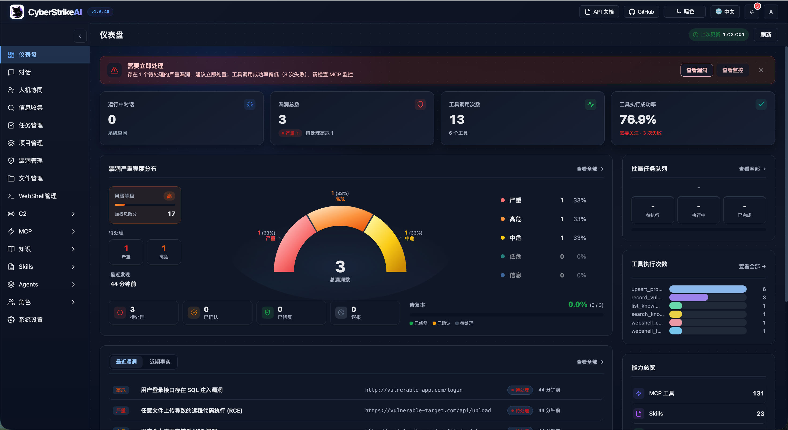

<div align="center">
  
</div>

# CyberStrikeAI


[中文](README_CN.md) | [English](README.md)

**The system of action for AI-native cybersecurity—where intent becomes governed execution, evidence becomes operational memory, and every operation improves the next.**

CyberStrikeAI connects planning, execution, human oversight, evidence, and replay in one auditable workspace. Built in Go, it combines Eino-powered agents, MCP-native tools, RAG knowledge, visual workflows, and attack-chain modeling and analysis for authorized security operations.

**Start here:** [Quick start](#quick-start-one-command-deployment) · [Documentation](docs/en-US/README.md) · [Security hardening](docs/en-US/security-hardening.md)

> [!IMPORTANT]
> Use CyberStrikeAI only on systems you own or are explicitly authorized to test. For shared or production environments, review the [security model](docs/en-US/security-model.md) and [hardening guide](docs/en-US/security-hardening.md) before enabling high-risk tools, WebShell, or C2 capabilities.

## Interface & Integration Preview

<div align="center">

### System Dashboard Overview

<table>
<tr>
<td width="50%" align="center">
<strong>Light Mode</strong><br/>

</td>
<td width="50%" align="center">
<strong>Dark Mode</strong><br/>

</td>
</tr>
</table>

*The dashboard provides a comprehensive overview of system runtime status, security vulnerabilities, tool usage, and knowledge base, helping users quickly understand the platform's core features and current state.*

<details>
<summary><strong>More interface screenshots</strong></summary>

### Core Features Overview

<table>
<tr>
<td width="33.33%" align="center">
<strong>Web Console</strong><br/>

</td>
<td width="33.33%" align="center">
<strong>Task Management</strong><br/>

</td>
<td width="33.33%" align="center">
<strong>Vulnerability Management</strong><br/>

</td>
</tr>
<tr>
<td width="33.33%" align="center">
<strong>WebShell Management</strong><br/>

</td>
<td width="33.33%" align="center">
<strong>MCP Management</strong><br/>

</td>
<td width="33.33%" align="center">
<strong>Knowledge Base</strong><br/>

</td>
</tr>
<tr>
<td width="33.33%" align="center">
<strong>Skills Management</strong><br/>

</td>
<td width="33.33%" align="center">
<strong>Agent Management</strong><br/>

</td>
<td width="33.33%" align="center">
<strong>Role Management</strong><br/>

</td>
</tr>
<tr>
<td width="33.33%" align="center">
<strong>System Settings</strong><br/>

</td>
<td width="33.33%" align="center">
<strong>MCP stdio Mode</strong><br/>

</td>
<td width="33.33%" align="center">
<strong>Burp Suite Plugin</strong><br/>

</td>
</tr>
</table>

</details>

</div>

## Highlights

### Agents and orchestration

- 🤖 **Agentic execution** translates natural-language intent into governed, auditable security actions.
- 🧩 **Eino orchestration** supports single-agent execution plus Deep, Plan-Execute, and Supervisor multi-agent modes.
- 🔀 **Graph workflows** combine Agents, tools, conditions, approvals, and outputs into reusable flows.
- 🎭 **Role-based testing** provides focused prompts and tool policies for common security scenarios.

### Tools and knowledge

- 🧰 **Security tools** include 100+ curated YAML recipes with custom extensions and role-scoped access.
- 🔌 **MCP integration** supports HTTP, stdio, SSE, external federation, and dynamic tool discovery.
- ⏱️ **Resilient tool execution** runs blocking MCP/tool calls in workers with bounded agent waits, resumable `execution_id` polling, cancellation, per-server circuit breakers, concurrency limits, and unified output caps.
- 🎯 **Agent Skills** follow the standard Skill layout and support progressive, on-demand loading.
- 📚 **Knowledge base** combines query rewriting, vector retrieval, reranking, and result post-processing.
- 🖼️ **Vision analysis** uses a separate vision model for screenshots, captchas, and UI while retaining text summaries only.

### Governance and audit

- 🧑‍⚖️ **Human in the loop** provides approval modes, tool allowlists, audit-agent review, and traceable decisions.
- 🔐 **Platform RBAC** supports multiple users, system and custom roles, scoped permissions, ownership, and explicit assignments.
- 🔒 **Security and audit** provide authenticated access, audit logs, SQLite persistence, and operational evidence retention.
- 📄 **Result governance** stores the same capped tool result seen by the agent, protects resume paths from oversized historical output, and adds UI safeguards for large detail views. See [Tool Execution Governance](docs/en-US/tool-execution-governance.md).

### Security operations

- 📁 **Conversation management** provides grouping, pinning, renaming, and batch organization.
- 📂 **Projects and attack chains** connect cross-session facts, risk scoring, graph views, and step-by-step replay.
- 🗂️ **Asset management** normalizes and deduplicates domains, IP addresses, ports, and services; supports XLSX/CSV import and export, advanced filters and saved views, ownership and business metadata, cross-page bulk maintenance, and duplicate merging; and tracks scan coverage, linked vulnerabilities, and risk state. See the [Asset Management guide](docs/en-US/asset-management.md).
- 🛡️ **Vulnerability management** provides severity classification, lifecycle tracking, filtering, and statistics.
- 📋 **Batch tasks** provide queued execution, editing, status tracking, and retained results.
- 📱 **Chatbots** connect Personal WeChat, WeCom, DingTalk, Lark, Telegram, Slack, Discord, and QQ Bot.

### Authorized security operations

- 🐚 **WebShell management** provides connection management, a virtual terminal, file operations, and AI-assisted workflows.
- 📡 **Built-in C2** provides listeners, encrypted beacons, sessions, task queues, payload helpers, and live events.

> WebShell, C2, and other high-risk capabilities are for systems you own or are explicitly authorized to test. See the [security model](docs/en-US/security-model.md) and [hardening guide](docs/en-US/security-hardening.md).

## Plugins

CyberStrikeAI includes optional integrations under `plugins/`.

- **Burp Suite extension**: `plugins/burp-suite/cyberstrikeai-burp-extension/`  
  Build output: `plugins/burp-suite/cyberstrikeai-burp-extension/dist/cyberstrikeai-burp-extension.jar`  
  Docs: `plugins/burp-suite/cyberstrikeai-burp-extension/README.md`
- **Browser extension (Chrome / Edge)**: `plugins/browser-extension/cyberstrikeai-browser-extension/`  
  Capture Network traffic in DevTools and send it to CyberStrikeAI for AI-assisted security testing—aligned with the Burp plugin.  
  Install: `chrome://extensions/` → Load unpacked → F12 → **CyberStrikeAI** tab  
  Package output: `plugins/browser-extension/cyberstrikeai-browser-extension/dist/cyberstrikeai-browser-extension.zip`  
  Docs: `plugins/browser-extension/cyberstrikeai-browser-extension/README.md` / `README.zh-CN.md`

## Tool Overview

CyberStrikeAI ships with 100+ curated tools covering the whole kill chain:

<details>
<summary><strong>View the complete tool categories</strong></summary>

- **Network Scanners** – nmap, masscan, rustscan, arp-scan, nbtscan
- **Web & App Scanners** – sqlmap, nikto, dirb, gobuster, feroxbuster, ffuf, httpx
- **Vulnerability Scanners** – nuclei, wpscan, wafw00f, dalfox, xsser
- **Subdomain Enumeration** – subfinder, amass, findomain, dnsenum, fierce
- **Network Space Search Engines** – fofa_search, zoomeye_search, quake_search, shodan_search
- **API Security** – graphql-scanner, arjun, api-fuzzer, api-schema-analyzer
- **Container Security** – trivy, clair, docker-bench-security, kube-bench, kube-hunter
- **Cloud Security** – prowler, scout-suite, cloudmapper, pacu, terrascan, checkov
- **Binary Analysis** – gdb, radare2, ghidra, objdump, strings, binwalk
- **Exploitation** – metasploit, msfvenom, pwntools, ropper, ropgadget
- **Password Cracking** – hashcat, john, hashpump
- **Forensics** – volatility, volatility3, foremost, steghide, exiftool
- **Post-Exploitation** – linpeas, winpeas, mimikatz, bloodhound, impacket, responder
- **CTF Utilities** – stegsolve, zsteg, hash-identifier, fcrackzip, pdfcrack, cyberchef
- **System Helpers** – exec, create-file, delete-file, list-files, modify-file

</details>

See [tools/README_EN.md](tools/README_EN.md) for tool definitions, customization, and usage notes.

## Basic Usage

### Quick Start (One-Command Deployment)

**Prerequisites:**
- Go 1.25+ ([Install](https://go.dev/dl/); required by `go.mod`)
- Python 3.10+ ([Install](https://www.python.org/downloads/))

**One-Command Deployment:**
```bash
git clone https://github.com/Ed1s0nZ/CyberStrikeAI.git
cd CyberStrikeAI
chmod +x run.sh && ./run.sh
```

The `run.sh` script will automatically:
- ✅ Check and validate Go & Python environments
- ✅ Create Python virtual environment
- ✅ Install Python dependencies
- ✅ Download Go dependencies
- ✅ Build the project
- ✅ Start the server

**Verify the startup:**

1. Confirm the terminal displays `● ONLINE` followed by the actual Web UI URL.
2. Open that URL; the default HTTPS mode uses a local self-signed certificate, so accept the browser warning once.
3. On a new installation, store the one-time `admin` password shown under `ADMIN SETUP REQUIRED`, sign in, and change it immediately.

**Networking defaults:** `run.sh` starts the server with **`--https`** and the repo **`config.yaml`** (local self-signed TLS; better for many concurrent streams). Use **`./run.sh --http`** for plain HTTP. In production, set **`server.tls_cert_path`** / **`server.tls_key_path`** in **`config.yaml`** (see comments there). For manual runs, add **`--https`** or **`CYBERSTRIKE_HTTPS=1`**; if **`-config`** is wrong, the binary prints a short usage hint on stderr.

**First-Time Configuration:**
1. **Configure AI channels** (required before first use)
   - After launch, open **`https://127.0.0.1:8080/`** (or **`https://localhost:8080/`**; replace **8080** with `server.port` in `config.yaml`) and accept the self-signed certificate warning once. If you used `./run.sh --http`, use **`http://`** instead.
   - Go to `System Settings` → `Basic Settings` → `AI Channel Configuration`, add or edit a channel, then fill in provider, Base URL, API key, model, and token limits. Click **Save changes**. The left channel list supports setting a default, copy, delete, and bulk probe.
     ```yaml
     ai:
       default_channel: openai-main
       channels:
         openai-main:
           name: OpenAI Main
           provider: openai_compatible
           api_key: "${OPENAI_API_KEY}"
           base_url: "https://api.openai.com/v1"  # or https://api.deepseek.com/v1
           model: "gpt-4o"  # or deepseek-chat, qwen3-max, etc.
           max_total_tokens: 120000
           max_completion_tokens: 16384
     ```
   - Or edit `config.yaml` directly before launching. `ai.default_channel` is used for new conversations and tasks that do not explicitly select a channel; the chat page can also select any saved channel per session.
2. **Login** - On first startup the console prints an auto-generated initial `admin` password; create accounts from **Platform permissions → User management**
3. **Install security tools (optional)** - Install tools from `tools/` as needed; missing tools are skipped or substituted at runtime. Common examples:

   **macOS (Homebrew):**
   ```bash
   brew install nmap masscan sqlmap nikto gobuster ffuf hydra hashcat nuclei subfinder
   ```

   **Linux (Kali / Debian / Ubuntu):**
   ```bash
   sudo apt update
   sudo apt install -y nmap masscan sqlmap nikto gobuster hydra hashcat john binwalk
   # On some distros, install ffuf/nuclei/subfinder via go install or upstream docs
   ```

   See the `tools/` directory for the full list; refer to each tool's official docs for install details.

**Alternative Launch Methods:**
```bash
# Direct Go run (set up env yourself); add --https to match run.sh defaults
go run cmd/server/main.go --https

# Manual build
go build -o cyberstrike-ai cmd/server/main.go
./cyberstrike-ai --https
```

If server logs show `client sent an HTTP request to an HTTPS server`, a client is still using **`http://`** on a TLS-only port—switch the URL to **`https://`**.

**Note:** The Python virtual environment (`venv/`) is automatically created and managed by `run.sh`. Tools that require Python (like `api-fuzzer`, `http-framework-test`, etc.) will automatically use this environment.

### Upgrade and Compatibility

**CyberStrikeAI one-click upgrade:**
1. (First time) enable the script: `chmod +x upgrade.sh`
2. Upgrade with: `./upgrade.sh` (optional flags: `--tag vX.Y.Z`, `--no-venv`, `--yes`). Local `tools/`, `roles/`, and `skills/` are always preserved.
3. The script will back up your `config.yaml` and `data/`, upgrade the code from GitHub Release, update `config.yaml`'s `version`, then restart the server.

Recommended one-liner:
`chmod +x upgrade.sh && ./upgrade.sh --yes`

If something goes wrong, you can restore from `.upgrade-backup/` (or manually copy `/data` and `config.yaml` back) and run `./run.sh` again.

Requirements / tips:
* You need `curl` or `wget` for downloading Release packages.
* `rsync` is recommended/required for the safe code sync.
* If GitHub API rate-limits you, set `export GITHUB_TOKEN="..."` before running `./upgrade.sh`.

⚠️ **Before upgrading:** review the target release notes for configuration, database, and API changes. Backups are required even for patch upgrades; a version number alone is not a compatibility guarantee.


## Configuration

Use [`config.example.yaml`](config.example.yaml) as the authoritative configuration template and copy only the values required for your environment. At minimum, configure the server and one AI channel:

```yaml
server:
  host: "127.0.0.1"
  port: 8080
ai:
  default_channel: openai-main
  channels:
    openai-main:
      provider: openai_compatible
      api_key: "${OPENAI_API_KEY}"
      base_url: "https://api.openai.com/v1"
      model: "your-model"
```

`openai` is a backward-compatible runtime field; maintain new model settings in `ai.channels`. Do not commit real credentials. Review the [configuration reference](docs/en-US/configuration.md), [recommended profiles](docs/en-US/configuration-profiles.md), and [security hardening guide](docs/en-US/security-hardening.md) before exposing the service beyond localhost.

## Related documentation

- **New users:** [Deployment](docs/en-US/deployment.md) → [Configuration](docs/en-US/configuration.md) → [Troubleshooting](docs/en-US/troubleshooting.md)
- **Operators:** [Configuration profiles](docs/en-US/configuration-profiles.md) → [Security hardening](docs/en-US/security-hardening.md) → [Runbooks](docs/en-US/runbooks.md)
- **Integrators:** [API reference](docs/en-US/api-reference.md) → [API recipes](docs/en-US/api-recipes.md) → [MCP federation](docs/en-US/mcp-federation.md)
- **Contributors:** [Developer guide](docs/en-US/developer-guide.md) → [Testing](docs/en-US/testing.md) → [Contributing](docs/en-US/contributing-guide.md)
- **All topics:** [English documentation](docs/en-US/README.md) · [Bilingual documentation index](docs/README.md)

## Project Layout

```
CyberStrikeAI/
├── cmd/                 # Server, MCP stdio entrypoints, tooling
├── internal/            # Agent, MCP core, handlers, C2 (`internal/c2`), security executor
├── web/                 # Static SPA + templates
├── tools/               # YAML tool recipes (100+ examples provided)
├── roles/               # Role configurations (12+ predefined security testing roles)
├── skills/              # Agent Skills dirs (SKILL.md + optional files; demo: cyberstrike-eino-demo)
├── agents/              # Multi-agent Markdown (orchestrator.md + sub-agent *.md)
├── docs/                # Topic docs (deployment, config, security, API, knowledge base, C2, WebShell, etc.)
├── images/              # Docs screenshots & diagrams
├── scripts/             # Repository maintenance checks, including documentation validation
├── config.yaml          # Runtime configuration
├── run.sh               # Convenience launcher
└── README*.md
```

## Basic Usage Examples

```
Scan open ports on 192.168.1.1
Perform a comprehensive port scan on 192.168.1.1 focusing on 80,443,22
Check if https://example.com/page?id=1 is vulnerable to SQL injection
Scan https://example.com for hidden directories and outdated software
Enumerate subdomains for example.com, then run nuclei against the results
```

## Advanced Playbooks

```
Load the recon-engagement template, run amass/subfinder, then brute-force dirs on every live host.
Use external Burp-based MCP server for authenticated traffic replay, then pass findings back for graphing.
Compress the 5 MB nuclei report, summarize critical CVEs, and attach the artifact to the conversation.
Build an attack chain for the latest engagement and export the node list with severity >= high.
```

## 404Starlink 


CyberStrikeAI has joined [404Starlink](https://github.com/knownsec/404StarLink)

## TCH Top-Ranked Intelligent Pentest Project  
<div align="left">
  <a href="https://zc.tencent.com/competition/competitionHackathon?code=cha004" target="_blank">
    
  </a>
</div>


---

## Community and Support

- Join the community on [Discord](https://discord.gg/8PjVCMu8Zw).

<details>
<summary><strong>WeChat group</strong></summary>


</details>

<details>
<summary><strong>Sponsorship via WeChat Pay or Alipay</strong></summary>

<div align="center">
  
</div>

</details>

## License

CyberStrikeAI is licensed under the Apache License 2.0.  
See the [LICENSE](LICENSE) file for details.

---

## ⚠️ Disclaimer

**This tool is for educational and authorized testing purposes only!**

CyberStrikeAI is a professional security testing platform designed to assist security researchers, penetration testers, and IT professionals in conducting security assessments and vulnerability research **with explicit authorization**.

**By using this tool, you agree to:**
- Use this tool only on systems where you have clear written authorization
- Comply with all applicable laws, regulations, and ethical standards
- Take full responsibility for any unauthorized use or misuse
- Not use this tool for any illegal or malicious purposes

**The developers are not responsible for any misuse!** Please ensure your usage complies with local laws and regulations, and that you have obtained explicit authorization from the target system owner.

For vulnerability reporting and deployment hardening guidance, see [SECURITY.md](SECURITY.md).

---

Need help or want to contribute? Open an issue or PR—community tooling additions are welcome!
