<div align="center">
  
</div>

# CyberStrikeAI-EV


[中文](README_CN.md) | [English](README.md)

**A customized CyberStrikeAI distribution for authorized, focused security validation, SRC workflows, and evidence-based remediation verification.**

CyberStrikeAI-EV is maintained in [zwdemz/CyberStrikeAI-EV](https://github.com/zwdemz/CyberStrikeAI-EV), based on [AIPentest/CyberStrikeAI v1.7.21](https://github.com/AIPentest/CyberStrikeAI/releases/tag/v1.7.21), upstream commit `82b0af10f8519bf4baaa08958a8dbe38299a7685`. It retains the Go/Eino agent platform, MCP integration, knowledge retrieval, workflows, and audit trail, with EV-specific role restrictions, tool readiness handling, DNSLog integration, reliability improvements, and security fixes. This is an independently maintained fork; upstream and EV tags with the same version number do not identify identical source trees.

**Start here:** [Quick start](#quick-start-one-command-deployment) · [Documentation](docs/en-US/README.md) · [Security hardening](docs/en-US/security-hardening.md)

> [!IMPORTANT]
> Use CyberStrikeAI only on systems you own or are explicitly authorized to test. For shared or production environments, review the [security model](docs/en-US/security-model.md) and [hardening guide](docs/en-US/security-hardening.md) before enabling high-risk tools, WebShell, or C2 capabilities.

## Focused Use Cases

| Use case | Intended work | Boundaries |
| --- | --- | --- |
| Education SRC | Validate an approved endpoint on one host using test accounts and synthetic student/teacher records; record minimal evidence. | The `EDUSRC渗透测试` role prohibits high-risk exploitation, large-scale scanning, and access to real personal records. |
| Enterprise SRC | Reproduce a scoped issue and document request differences, prerequisites, and remediation evidence under the program's rules. | The `企业SRC渗透测试` role prohibits bulk target expansion, credential attacks, destructive actions, and business-state changes. |
| API, JWT, and schema checks | Inspect a test JWT offline, validate a local OpenAPI document, or compare approved GET/HEAD/OPTIONS responses. | Use the role's tool allowlist; do not turn offline analysis into online exploitation or modify business data. |
| Remediation verification | Repeat a small, approved check against a fixed endpoint and compare evidence before and after a fix. | Report confirmed, suspected, unverified, and environment-limited findings separately; redact credentials and personal data. |

The two SRC roles use the server-enforced `src-low-impact` policy: one host selected by the first network call, up to 50 network tool calls per run, at least one second between calls, serialized execution, and at most 10 explicit Nmap ports. Child agents share the same limits. HTTP methods are restricted to GET/HEAD/OPTIONS; shell execution, arbitrary Python, package installation, and batch tasks are unavailable to these roles. These are tool-call limits, not packet quotas or proof of authorization; a GET endpoint can still change state. Operators must define scope and safe test data before execution. See [SRC tool policy and installation](docs/src-tool-policy.md) (Chinese).

## EV Customizations

- **Role and execution controls:** education/enterprise SRC prompts work with runtime tool and parameter restrictions, platform RBAC, audit logging, and configurable tool-call guards. Prompts alone are not a security boundary.
- **Tool readiness:** missing commands are reported for operator installation and reload. Restricted SRC roles cannot use Python or child agents to bypass unavailable or forbidden tools. The Ubuntu installer keeps its tools and dependencies under `tools/runtime/`.
- **Additional DNSLog provider:** [`dig-pm-dnslog`](docs/dig-pm-dnslog.md) is a native MCP tool backed by HTTPS/WSS, with user/conversation-bound sessions and no Python dependency. It is not automatically added to the two restricted SRC roles.
- **Summary recovery:** explicit output truncation permits one shorter retry with the original input and output budget; an incomplete summary never replaces conversation history. See [troubleshooting](docs/en-US/troubleshooting.md).
- **Dependency fixes and storage controls:** patched dependencies, storage previews and confirmed deletion, and automatic storage cleanup disabled by default. Upstream localization and storage changes remain part of the v1.7.21 baseline. See the [sync record](docs/zh-CN/upstream-v1.7.21-sync.md) (Chinese).

The inherited WebShell, C2, broad reconnaissance, and batch capabilities listed below are outside the two SRC roles. Availability elsewhere depends on role permissions, configuration, and explicit authorization for that environment.

## Releases and Change History

Use this fork's [Releases](https://github.com/zwdemz/CyberStrikeAI-EV/releases). Future tag names use SemVer (`vMAJOR.MINOR.PATCH`); annotated tag messages, Release titles, and Release notes are written in English. Notes record updates, optimizations, bug fixes, security fixes, hardening, validation, and upgrade/rollback considerations, with the upstream baseline identified separately.

Development takes place on `dev`; signed changes reach `main` through a `dev → main` PR. Release tags point to the verified release commit on `main`. See the [release process](docs/en-US/release-process.md).

## Interface & Integration Preview

<div align="center">

### System Dashboard Overview

<table>
<tr>
<td width="50%" align="center">
<strong>Light Mode</strong><br/>
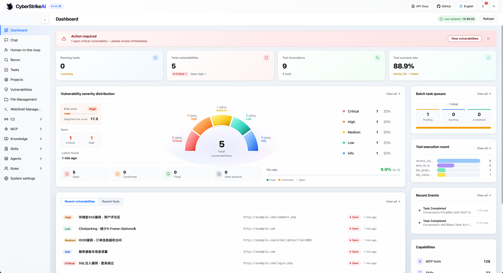
</td>
<td width="50%" align="center">
<strong>Dark Mode</strong><br/>
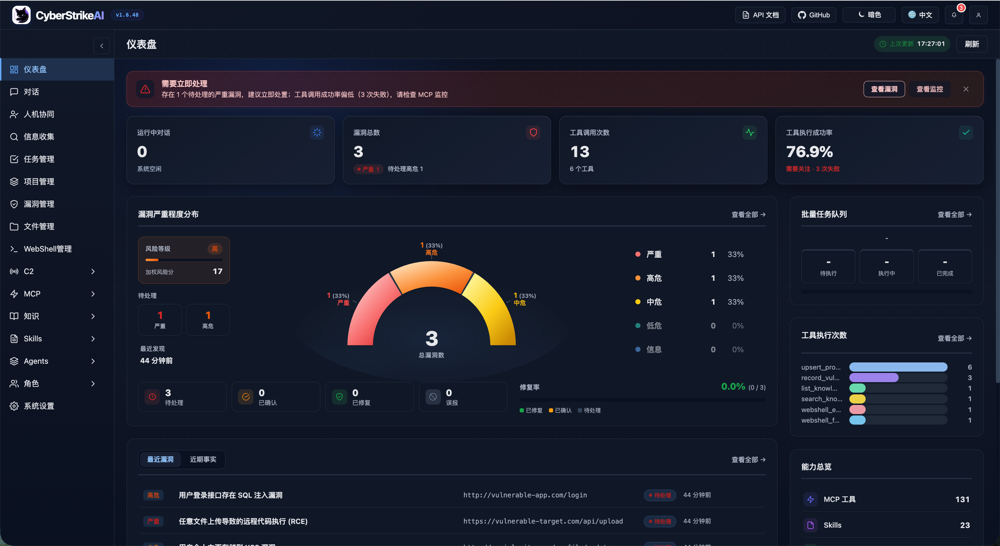
</td>
</tr>
</table>

*The dashboard provides a comprehensive overview of system runtime status, security vulnerabilities, tool usage, and knowledge base, helping users quickly understand the platform's core features and current state.*

<details>
<summary><strong>More interface screenshots</strong></summary>

### Core Features Overview

<table>
<tr>
<td width="33.33%" align="center">
<strong>Web Console</strong><br/>
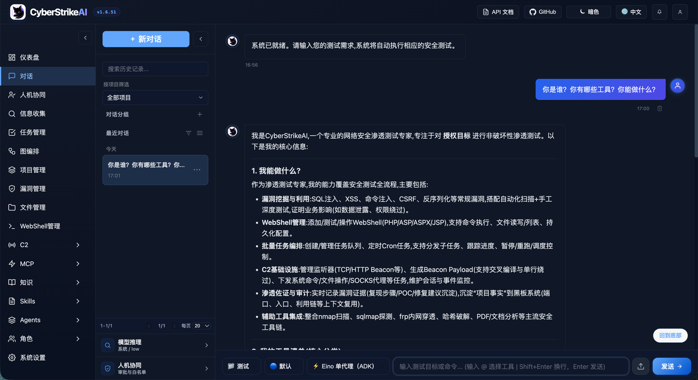
</td>
<td width="33.33%" align="center">
<strong>Task Management</strong><br/>
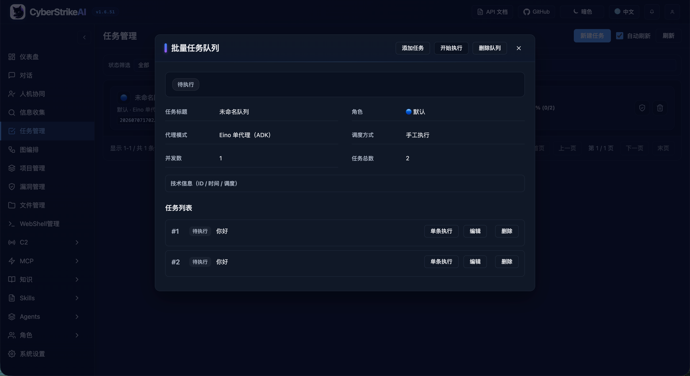
</td>
<td width="33.33%" align="center">
<strong>Vulnerability Management</strong><br/>
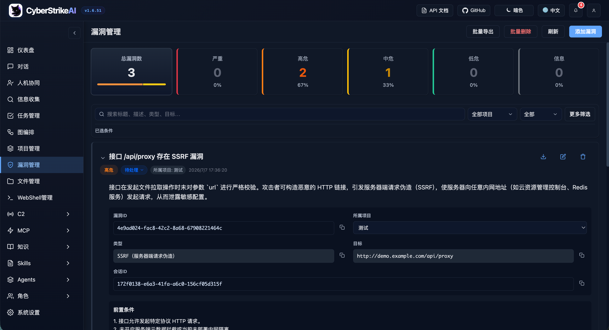
</td>
</tr>
<tr>
<td width="33.33%" align="center">
<strong>WebShell Management</strong><br/>
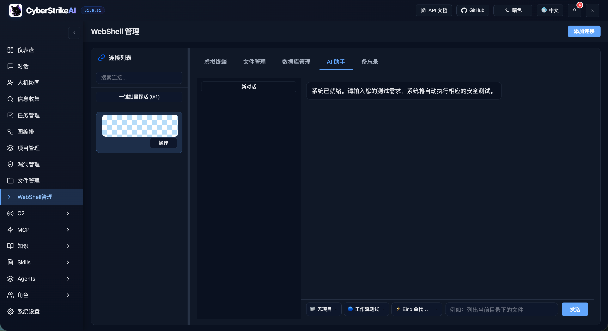
</td>
<td width="33.33%" align="center">
<strong>MCP Management</strong><br/>
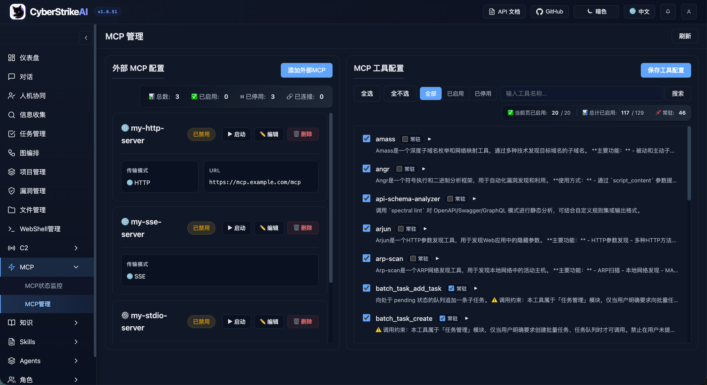
</td>
<td width="33.33%" align="center">
<strong>Knowledge Base</strong><br/>
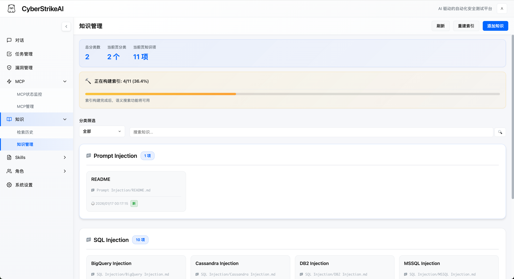
</td>
</tr>
<tr>
<td width="33.33%" align="center">
<strong>Skills Management</strong><br/>
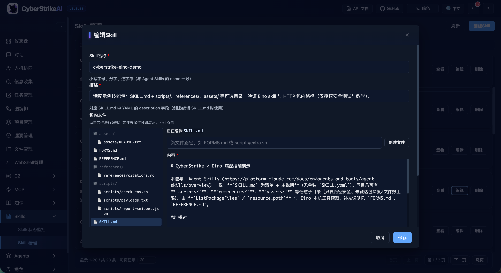
</td>
<td width="33.33%" align="center">
<strong>Agent Management</strong><br/>
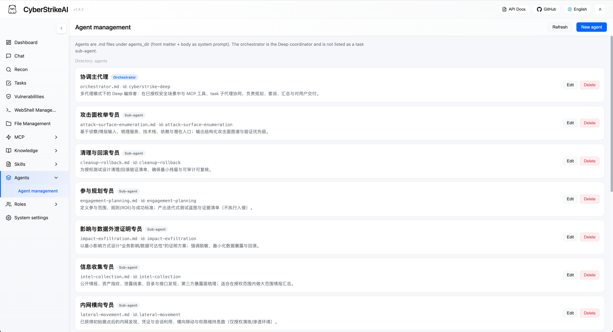
</td>
<td width="33.33%" align="center">
<strong>Role Management</strong><br/>
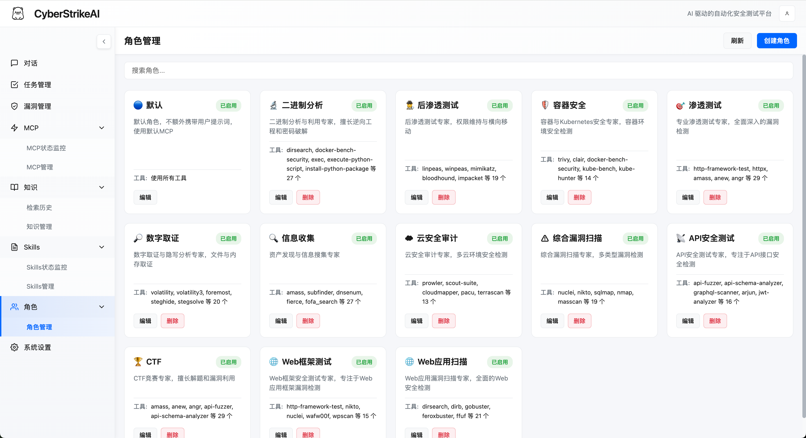
</td>
</tr>
<tr>
<td width="33.33%" align="center">
<strong>System Settings</strong><br/>
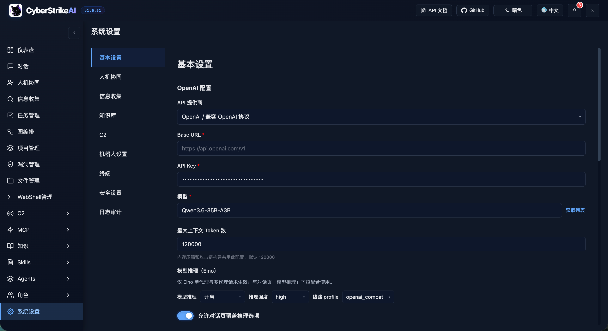
</td>
<td width="33.33%" align="center">
<strong>MCP stdio Mode</strong><br/>
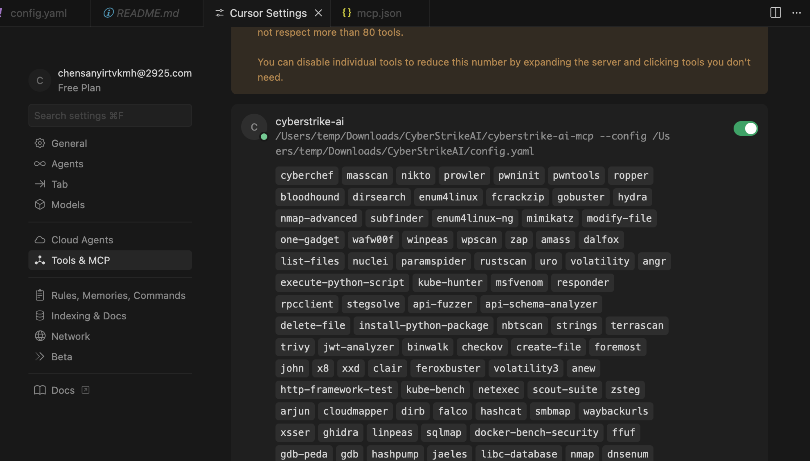
</td>
<td width="33.33%" align="center">
<strong>Burp Suite Plugin</strong><br/>
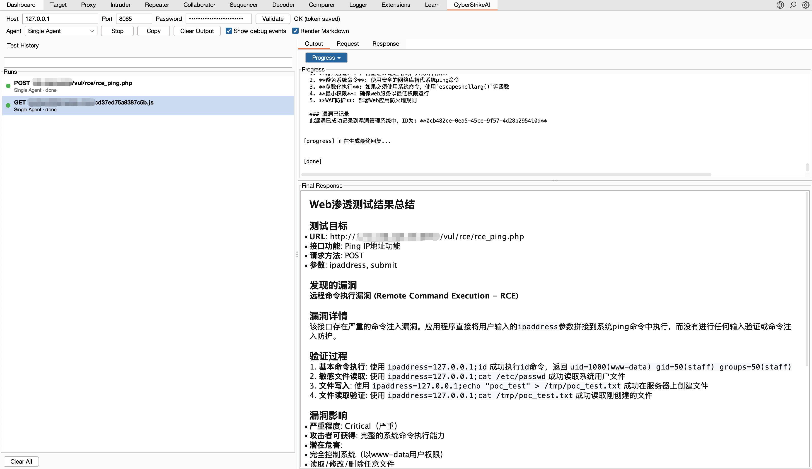
</td>
</tr>
</table>

</details>

</div>

## Highlights

### Agents and orchestration

- 🤖 **Agentic execution** translates natural-language intent into governed, auditable security actions.
- 🧩 **Eino orchestration** supports single-agent execution plus Deep, Plan-Execute, and Supervisor multi-agent modes.
- 🔀 **Graph workflows** combine Agents, tools, conditions, approvals, and outputs into reusable flows.
- 🎭 **Role-based testing** provides focused prompts and tool policies for common security scenarios.

### Tools and knowledge

- 🧰 **Security tools** include 100+ curated YAML recipes with custom extensions and role-scoped access.
- 🔌 **MCP integration** supports HTTP, stdio, SSE, external federation, and dynamic tool discovery.
- ⏱️ **Resilient tool execution** runs blocking MCP/tool calls in workers with bounded agent waits, resumable `execution_id` polling, cancellation, per-server circuit breakers, concurrency limits, and unified output caps.
- 🎯 **Agent Skills** follow the standard Skill layout and support progressive, on-demand loading.
- 📚 **Knowledge base** combines query rewriting, vector retrieval, reranking, and result post-processing.
- 🖼️ **Vision analysis** uses a separate vision model for screenshots, captchas, and UI while retaining text summaries only.

### Governance and audit

- 🧑‍⚖️ **Human in the loop** provides approval modes, tool allowlists, audit-agent review, and traceable decisions.
- 🛡️ **Call blocking** under Security adds configurable regex checks before MCP execution, reminder templates, and dry runs, with government-domain protection enabled by default. See [Tool call blocking](docs/en-US/tool-call-guard.md).
- 🔐 **Platform RBAC** supports multiple users, system and custom roles, scoped permissions, ownership, and explicit assignments.
- 🔒 **Security and audit** provide authenticated access, audit logs, SQLite persistence, and operational evidence retention.
- 📄 **Result governance** stores the same capped tool result seen by the agent, protects resume paths from oversized historical output, and adds UI safeguards for large detail views. See [Tool Execution Governance](docs/en-US/tool-execution-governance.md).

### Security operations

- 📁 **Conversation management** provides pinning, renaming, and batch organization.
- 📂 **Projects and attack chains** connect cross-session facts, risk scoring, graph views, and step-by-step replay.
- 🗂️ **Asset management** normalizes and deduplicates domains, IP addresses, ports, and services; supports XLSX/CSV import and export, advanced filters and saved views, ownership and business metadata, cross-page bulk maintenance, and duplicate merging; and tracks scan coverage, linked vulnerabilities, and risk state. See the [Asset Management guide](docs/en-US/asset-management.md).
- 🛡️ **Vulnerability management** provides severity classification, lifecycle tracking, filtering, and statistics.
- 📋 **Batch tasks** provide queued execution, editing, status tracking, and retained results.
- 📱 **Chatbots** connect Personal WeChat, WeCom, DingTalk, Lark, Telegram, Slack, Discord, and QQ Bot.

### Authorized security operations

- 🐚 **WebShell management** provides connection management, a virtual terminal, file operations, and AI-assisted workflows.
- 📡 **Built-in C2** provides listeners, encrypted beacons, sessions, task queues, payload helpers, and live events.

> WebShell, C2, and other high-risk capabilities are for systems you own or are explicitly authorized to test. See the [security model](docs/en-US/security-model.md) and [hardening guide](docs/en-US/security-hardening.md).

## Plugins

CyberStrikeAI includes optional integrations under `plugins/`.

- **Burp Suite extension**: `plugins/burp-suite/cyberstrikeai-burp-extension/`  
  Build output: `plugins/burp-suite/cyberstrikeai-burp-extension/dist/cyberstrikeai-burp-extension.jar`  
  Docs: `plugins/burp-suite/cyberstrikeai-burp-extension/README.md`
- **Browser extension (Chrome / Edge)**: `plugins/browser-extension/cyberstrikeai-browser-extension/`  
  Capture Network traffic in DevTools and send it to CyberStrikeAI for AI-assisted security testing—aligned with the Burp plugin.  
  Install: `chrome://extensions/` → Load unpacked → F12 → **CyberStrikeAI** tab  
  Package output: `plugins/browser-extension/cyberstrikeai-browser-extension/dist/cyberstrikeai-browser-extension.zip`  
  Docs: `plugins/browser-extension/cyberstrikeai-browser-extension/README.md` / `README.zh-CN.md`

## Tool Overview

CyberStrikeAI ships with 100+ curated tools covering the whole kill chain:

<details>
<summary><strong>View the complete tool categories</strong></summary>

- **Network Scanners** – nmap, masscan, rustscan, arp-scan, nbtscan
- **Web & App Scanners** – sqlmap, nikto, dirb, gobuster, feroxbuster, ffuf, httpx
- **Vulnerability Scanners** – nuclei, wpscan, wafw00f, dalfox, xsser
- **Subdomain Enumeration** – subfinder, amass, findomain, dnsenum, fierce
- **Network Space Search Engines** – fofa_search, zoomeye_search, quake_search, shodan_search
- **API Security** – graphql-scanner, arjun, api-fuzzer, api-schema-analyzer
- **Container Security** – trivy, clair, docker-bench-security, kube-bench, kube-hunter
- **Cloud Security** – prowler, scout-suite, cloudmapper, pacu, terrascan, checkov
- **Binary Analysis** – gdb, radare2, ghidra, objdump, strings, binwalk
- **Exploitation** – metasploit, msfvenom, pwntools, ropper, ropgadget
- **Password Cracking** – hashcat, john, hashpump
- **Forensics** – volatility, volatility3, foremost, steghide, exiftool
- **Post-Exploitation** – linpeas, winpeas, mimikatz, bloodhound, impacket, responder
- **CTF Utilities** – stegsolve, zsteg, hash-identifier, fcrackzip, pdfcrack, cyberchef
- **System Helpers** – exec, create-file, delete-file, list-files, modify-file

</details>

See [tools/README_EN.md](tools/README_EN.md) for tool definitions, customization, and usage notes.

## Basic Usage

### Quick Start (One-Command Deployment)

**Prerequisites:**
- Go 1.26.8+ ([Install](https://go.dev/dl/); required by `go.mod`)
- Python 3.10+ ([Install](https://www.python.org/downloads/))

**One-Command Deployment:**
```bash
git clone --branch main https://github.com/zwdemz/CyberStrikeAI-EV.git
cd CyberStrikeAI-EV
chmod +x run.sh && ./run.sh
```

The `run.sh` script will automatically:
- ✅ Check and validate Go & Python environments
- ✅ Create Python virtual environment
- ✅ Install Python dependencies
- ✅ Download Go dependencies
- ✅ Build the project
- ✅ Start the server

**Verify the startup:**

1. Confirm the terminal displays `● ONLINE` followed by the actual Web UI URL.
2. Open that URL; the default HTTPS mode uses a local self-signed certificate, so accept the browser warning once.
3. On a new installation, store the one-time `admin` password shown under `ADMIN SETUP REQUIRED`, sign in, and change it immediately.

**Networking defaults:** `run.sh` starts the server with **`--https`** and the repo **`config.yaml`** (local self-signed TLS; better for many concurrent streams). Use **`./run.sh --http`** for plain HTTP. In production, set **`server.tls_cert_path`** / **`server.tls_key_path`** in **`config.yaml`** (see comments there). For manual runs, add **`--https`** or **`CYBERSTRIKE_HTTPS=1`**; if **`-config`** is wrong, the binary prints a short usage hint on stderr.

**First-Time Configuration:**
1. **Configure AI channels** (required before first use)
   - After launch, open **`https://127.0.0.1:8080/`** (or **`https://localhost:8080/`**; replace **8080** with `server.port` in `config.yaml`) and accept the self-signed certificate warning once. If you used `./run.sh --http`, use **`http://`** instead.
   - Go to `System Settings` → `Basic Settings` → `AI Channel Configuration`, add or edit a channel, then fill in provider, Base URL, API key, model, and token limits. Click **Save changes**. The left channel list supports setting a default, copy, delete, and bulk probe.
     ```yaml
     ai:
       default_channel: openai-main
       channels:
         openai-main:
           name: OpenAI Main
           provider: openai_compatible
           api_key: "${OPENAI_API_KEY}"
           base_url: "https://api.openai.com/v1"  # or https://api.deepseek.com/v1
           model: "gpt-4o"  # or deepseek-chat, qwen3-max, etc.
           max_total_tokens: 120000
           max_completion_tokens: 16384
     ```
   - Or edit `config.yaml` directly before launching. `ai.default_channel` is used for new conversations and tasks that do not explicitly select a channel; the chat page can also select any saved channel per session.
2. **Login** - On first startup the console prints an auto-generated initial `admin` password; create accounts from **Platform permissions → User management**
3. **Install only the tools required by the selected role.** For the education/enterprise SRC roles on Ubuntu:

   ```bash
   bash tools/install-src-tools.sh
   ```

   Programs and dependencies are installed under `tools/runtime/` without sudo. Reload tool configuration or restart after installation. Missing tools must be repaired by an operator; the restricted roles cannot substitute arbitrary Python or shell execution. Other roles may use equivalent alternatives only within their own permissions and installed dependencies. See [SRC tool policy](docs/src-tool-policy.md) (Chinese) and [tool definitions](tools/README_EN.md). The installer is Ubuntu-specific; Windows/macOS need compatible local tools.

**Alternative Launch Methods:**
```bash
# Direct Go run (set up env yourself); add --https to match run.sh defaults
go run cmd/server/main.go --https

# Manual build
go build -o cyberstrike-ai cmd/server/main.go
./cyberstrike-ai --https
```

If server logs show `client sent an HTTP request to an HTTPS server`, a client is still using **`http://`** on a TLS-only port—switch the URL to **`https://`**.

**Note:** The Python virtual environment (`venv/`) is automatically created and managed by `run.sh`. Tools that require Python (like `api-fuzzer`, `http-framework-test`, etc.) will automatically use this environment.

### Upgrade and Compatibility

EV releases are published in [zwdemz/CyberStrikeAI-EV](https://github.com/zwdemz/CyberStrikeAI-EV/releases). The inherited `upgrade.sh` currently hardcodes `Ed1s0nZ/CyberStrikeAI`; running it unmodified downloads upstream code and can overwrite EV customizations. Use the controlled procedure below for this fork.

1. Read the target EV Release notes, including the upstream baseline, security fixes, and configuration or database changes.
2. Obtain the release source in a separate directory, verify the signed tag against a trusted maintainer key, and build with the Go version required by `go.mod`.
3. Back up the current executable, source, configuration, a consistent database snapshot, and custom tools/roles/skills/agents. Record the launch command and environment privately.
4. After active tasks finish, stop the service gracefully. Install the matching executable and source/static files, merge configuration changes, and review changes to role/tool policies while preserving local credentials and runtime data.
5. Restart using the recorded launch configuration and verify login, role restrictions, tool readiness, and the relevant feature. Follow the [release process](docs/en-US/release-process.md) for rollback; do not overwrite newer runtime data without assessing the impact.

For the v1.7.21 baseline, the default summary reserve increased to 40960. Explicitly set `multi_agent.eino_middleware.summarization_output_reserve_tokens: 8192` to retain the previous default when appropriate for your provider. Automatic storage cleanup remains disabled by default. Patch version numbers alone do not guarantee compatibility.


## Configuration

Use [`config.example.yaml`](config.example.yaml) as the authoritative configuration template and copy only the values required for your environment. At minimum, configure the server and one AI channel:

```yaml
server:
  host: "127.0.0.1"
  port: 8080
ai:
  default_channel: openai-main
  channels:
    openai-main:
      provider: openai_compatible
      api_key: "${OPENAI_API_KEY}"
      base_url: "https://api.openai.com/v1"
      model: "your-model"
```

`openai` is a backward-compatible runtime field; maintain new model settings in `ai.channels`. Do not commit real credentials. Review the [configuration reference](docs/en-US/configuration.md), [recommended profiles](docs/en-US/configuration-profiles.md), and [security hardening guide](docs/en-US/security-hardening.md) before exposing the service beyond localhost.

## Related documentation

- **New users:** [Deployment](docs/en-US/deployment.md) → [Configuration](docs/en-US/configuration.md) → [Troubleshooting](docs/en-US/troubleshooting.md)
- **Operators:** [Configuration profiles](docs/en-US/configuration-profiles.md) → [Security hardening](docs/en-US/security-hardening.md) → [Runbooks](docs/en-US/runbooks.md)
- **Integrators:** [API reference](docs/en-US/api-reference.md) → [API recipes](docs/en-US/api-recipes.md) → [MCP federation](docs/en-US/mcp-federation.md)
- **Contributors:** [Developer guide](docs/en-US/developer-guide.md) → [Testing](docs/en-US/testing.md) → [Contributing](docs/en-US/contributing-guide.md)
- **All topics:** [English documentation](docs/en-US/README.md) · [Bilingual documentation index](docs/README.md)

## Project Layout

```
CyberStrikeAI-EV/
├── cmd/                 # Server, MCP stdio entrypoints, tooling
├── internal/            # Agent, MCP core, handlers, C2 (`internal/c2`), security executor
├── web/                 # Static SPA + templates
├── tools/               # YAML tool recipes (100+ examples provided)
├── roles/               # Role configurations (12+ predefined security testing roles)
├── skills/              # Agent Skills dirs (SKILL.md + optional files; demo: cyberstrike-eino-demo)
├── agents/              # Multi-agent Markdown (orchestrator.md + sub-agent *.md)
├── docs/                # Topic docs (deployment, config, security, API, knowledge base, C2, WebShell, etc.)
├── images/              # Docs screenshots & diagrams
├── config.yaml          # Runtime configuration
├── run.sh               # Convenience launcher
└── README*.md
```

## Basic Usage Examples

Use an approved test host and an SRC role. Replace the illustrative hostname below with the explicitly authorized target before execution.

```text
Use the education SRC role to compare GET responses from the approved /profile endpoint on training.example.test using two test accounts. Do not read real student records.
Inspect my test JWT offline and explain its claims without contacting an online target or attempting signature cracking.
Validate the uploaded OpenAPI document with the built-in schema rules and report evidence separately from unverified risks.
```

## Advanced Playbooks

```text
Use the enterprise SRC role to recheck one previously reported endpoint after its fix, keeping the same authorized host and test records.
Summarize already collected, redacted evidence and label each finding as confirmed, suspected, unverified, or environment-limited.
Review the configured role's permitted tools and missing dependencies before a task; ask the operator to repair missing tools instead of bypassing its policy.
```

The following community recognition and support channels belong to the upstream CyberStrikeAI project.

## 404Starlink 


CyberStrikeAI has joined [404Starlink](https://github.com/knownsec/404StarLink)

## TCH Top-Ranked Intelligent Pentest Project  
<div align="left">
  <a href="https://zc.tencent.com/competition/competitionHackathon?code=cha004" target="_blank">
    
  </a>
</div>


---

## Upstream Community and Support

- Join the community on [Discord](https://discord.gg/8PjVCMu8Zw).

<details>
<summary><strong>WeCom group</strong></summary>


</details>

## License

CyberStrikeAI is licensed under the Apache License 2.0.  
See the [LICENSE](LICENSE) file for details.

---

## ⚠️ Disclaimer

**This tool is for educational and authorized testing purposes only!**

CyberStrikeAI is a professional security testing platform designed to assist security researchers, penetration testers, and IT professionals in conducting security assessments and vulnerability research **with explicit authorization**.

**By using this tool, you agree to:**
- Use this tool only on systems where you have clear written authorization
- Comply with all applicable laws, regulations, and ethical standards
- Take full responsibility for any unauthorized use or misuse
- Not use this tool for any illegal or malicious purposes

**The developers are not responsible for any misuse!** Please ensure your usage complies with local laws and regulations, and that you have obtained explicit authorization from the target system owner.

For vulnerability reporting and deployment hardening guidance, see [SECURITY.md](SECURITY.md).

---

Need help or want to contribute? Open an issue or PR—community tooling additions are welcome!
