<div align="center">
  
</div>

# CyberStrikeAI

[中文](README_CN.md) | [English](README.md)

**社区**：[加入 Discord](https://discord.gg/8PjVCMu8Zw)

<details>
<summary><strong>微信群</strong>（点击展开二维码）</summary>


</details>

<details>
<summary><strong>赞助</strong>（点击展开）</summary>

若 CyberStrikeAI 对您有帮助，可通过 **微信支付** 或 **支付宝** 赞助项目：

<div align="center">
  
</div>

</details>

CyberStrikeAI 是一款 **AI 原生安全测试平台**，基于 Go 构建，集成了 100+ 安全工具、智能编排引擎、角色化测试与预设安全测试角色、Skills 技能系统与专业测试技能、完整的测试生命周期管理能力，以及面向 **授权场景** 的 **内置轻量 C2（Command & Control，指挥与控制）** 能力（监听器、加密通信、会话与任务、实时事件、REST 与 MCP 协同）。通过原生 MCP 协议与 AI 智能体，支持从对话指令到漏洞发现、攻击链分析、知识检索与结果可视化的全流程自动化，为安全团队提供可审计、可追溯、可协作的专业测试环境。

## 界面与集成预览

<div align="center">

### 系统仪表盘概览

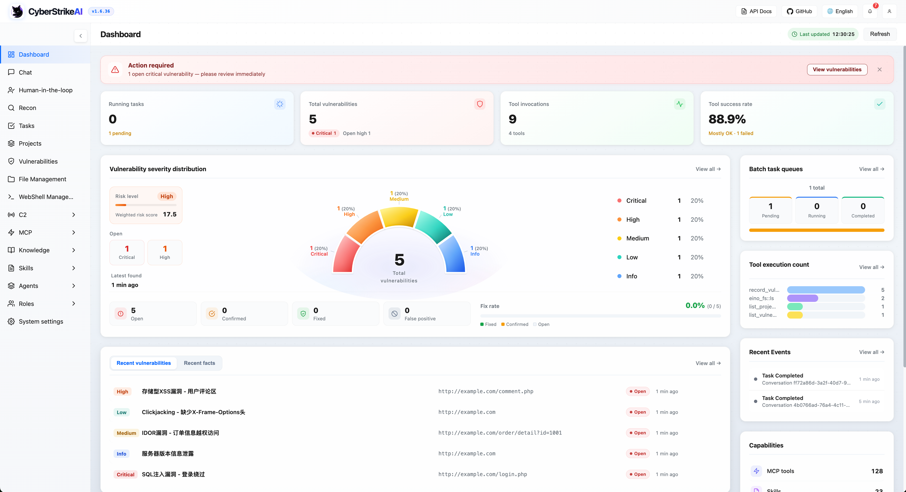

*仪表盘提供系统运行状态、安全漏洞、工具使用情况和知识库的全面概览，帮助用户快速了解平台核心功能和当前状态。*

### 核心功能概览

<table>
<tr>
<td width="33.33%" align="center">
<strong>Web 控制台</strong><br/>
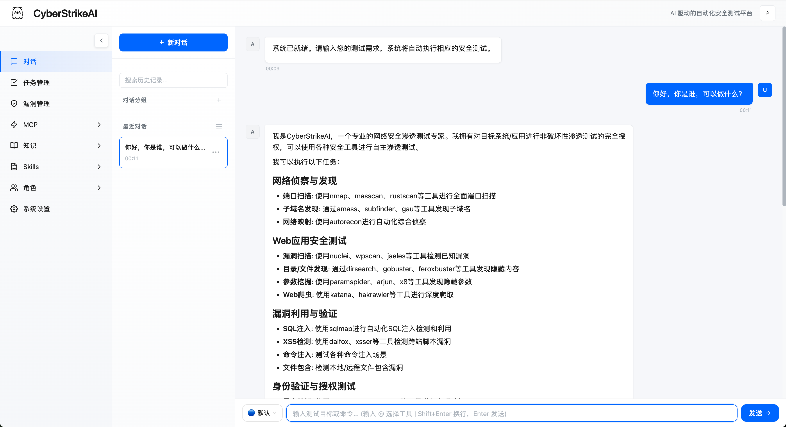
</td>
<td width="33.33%" align="center">
<strong>任务管理</strong><br/>
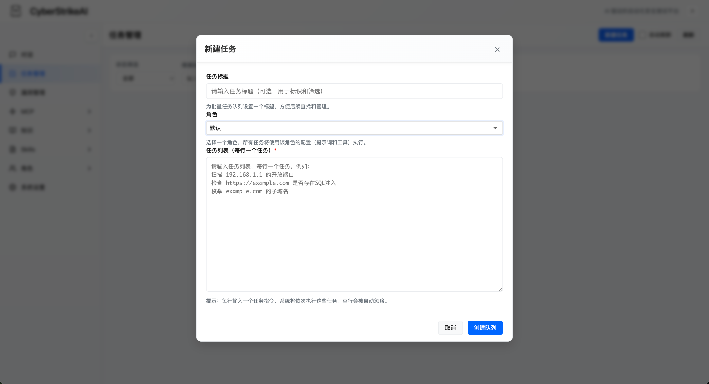
</td>
<td width="33.33%" align="center">
<strong>漏洞管理</strong><br/>
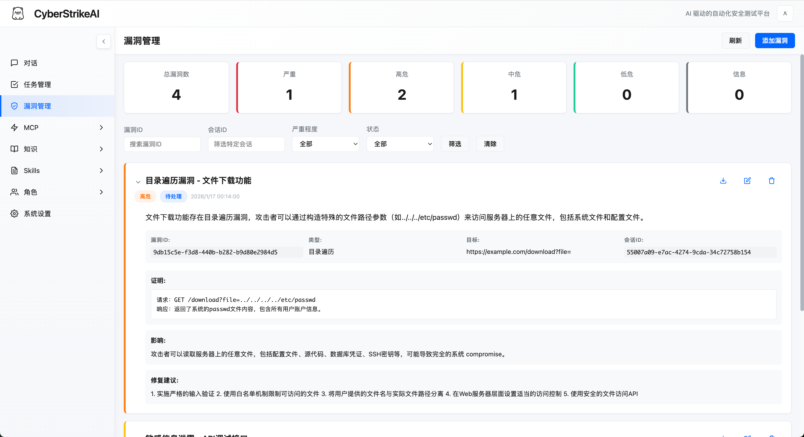
</td>
</tr>
<tr>
<td width="33.33%" align="center">
<strong>WebShell 管理</strong><br/>
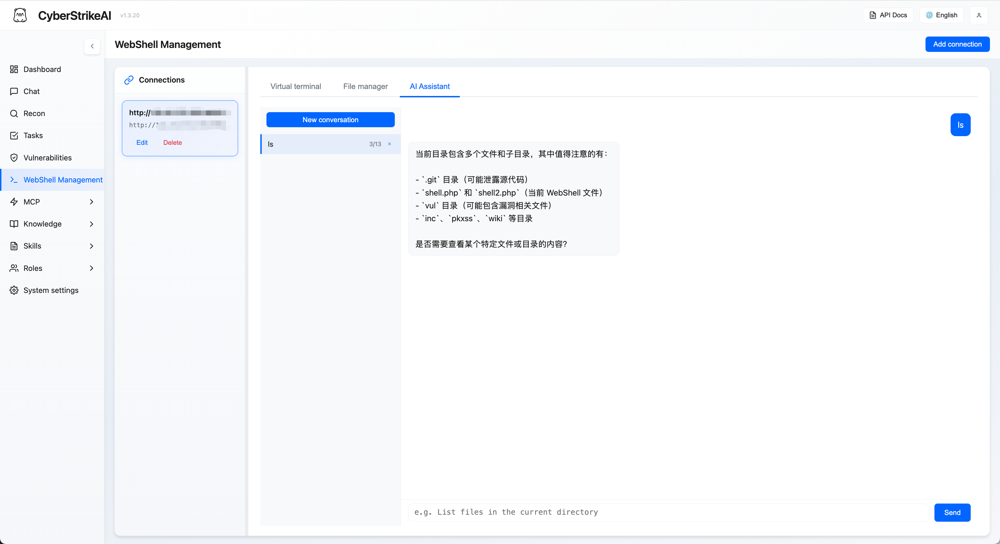
</td>
<td width="33.33%" align="center">
<strong>MCP 管理</strong><br/>
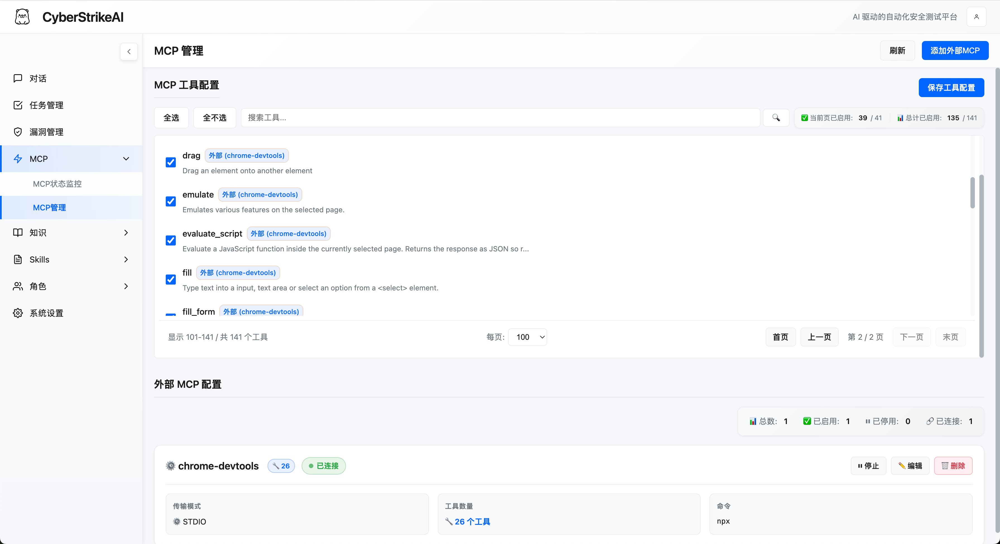
</td>
<td width="33.33%" align="center">
<strong>知识库</strong><br/>
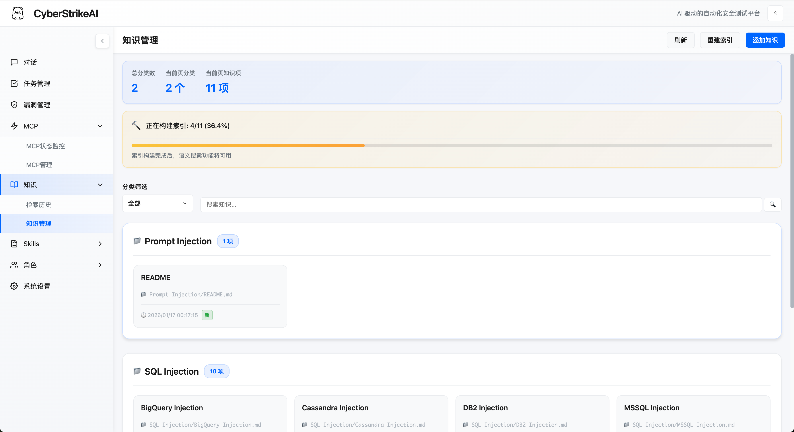
</td>
</tr>
<tr>
<td width="33.33%" align="center">
<strong>Skills 管理</strong><br/>
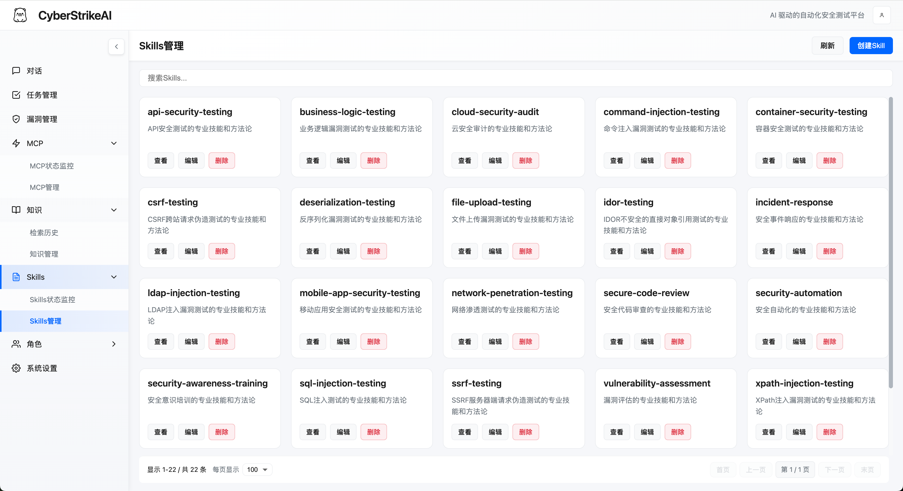
</td>
<td width="33.33%" align="center">
<strong>Agent 管理</strong><br/>
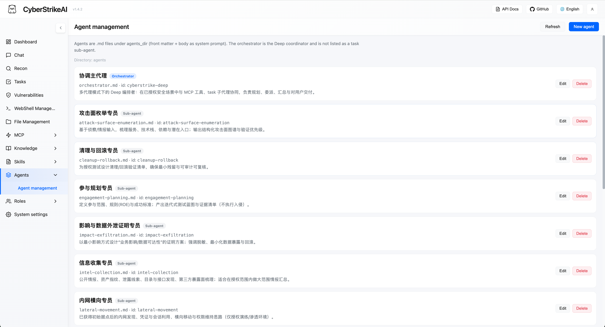
</td>
<td width="33.33%" align="center">
<strong>角色管理</strong><br/>
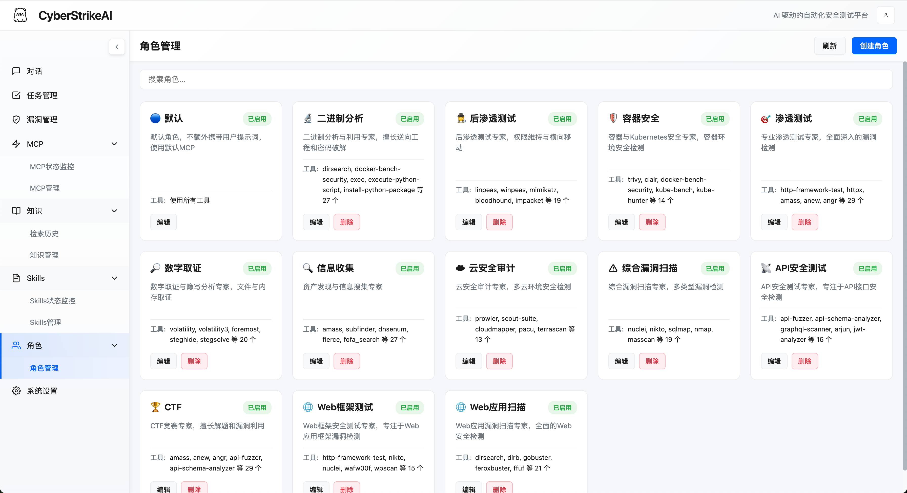
</td>
</tr>
<tr>
<td width="33.33%" align="center">
<strong>系统设置</strong><br/>
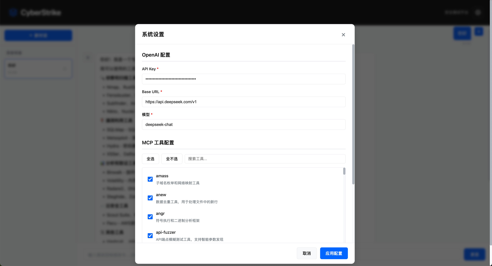
</td>
<td width="33.33%" align="center">
<strong>MCP stdio 模式</strong><br/>
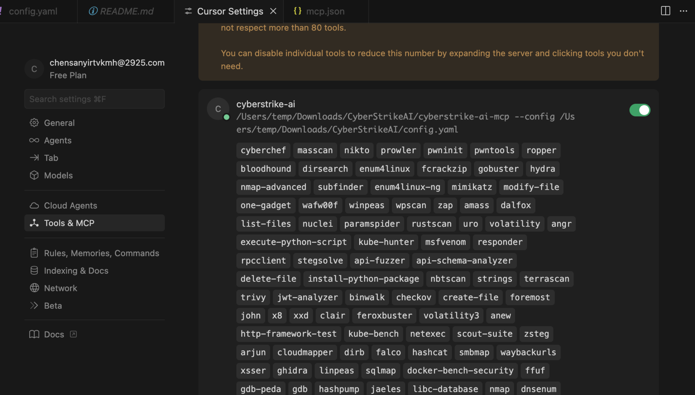
</td>
<td width="33.33%" align="center">
<strong>Burp Suite 插件</strong><br/>
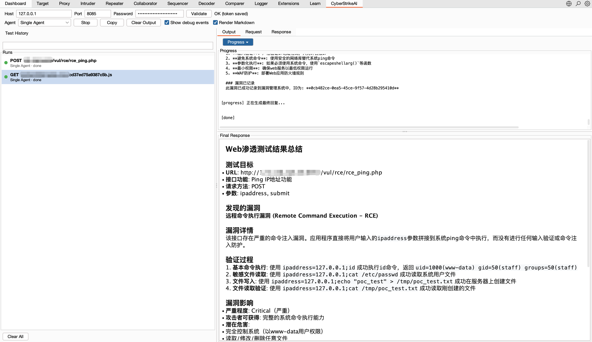
</td>
</tr>
</table>

</div>

## 特性速览

- 🤖 兼容 OpenAI/DeepSeek/Claude 等模型的智能决策引擎
- 🔌 原生 MCP 协议，支持 HTTP / stdio / SSE 传输模式以及外部 MCP 接入
- 🧰 100+ 现成工具模版 + YAML 扩展能力
- 📄 大结果分页、压缩与全文检索
- 🔗 攻击链可视化、风险打分与步骤回放
- 🔒 Web 登录保护、审计日志、SQLite 持久化
- 📚 知识库（RAG）：向量嵌入与余弦相似度检索（与 Eino `retriever.Retriever` 语义一致），可选 **Eino Compose** 索引流水线及检索后处理（预算、重排等配置项）
- 📁 对话分组管理：支持分组创建、置顶、重命名、删除等操作
- 📂 **项目管理**：共享事实（黑板）跨会话沉淀认知，`upsert_project_fact` + `links` 串联攻击路径；聊天攻击链与项目事实图可视化
- 🛡️ 漏洞管理功能：完整的漏洞 CRUD 操作，支持严重程度分级、状态流转、按对话/严重程度/状态过滤，以及统计看板
- 📋 批量任务管理：创建任务队列，批量添加任务，依次顺序执行，支持任务编辑与状态跟踪
- 🎭 角色化测试：预设安全测试角色（渗透测试、CTF、Web 应用扫描等），支持自定义提示词和工具限制
- 🧩 **Agent 编排（CloudWeGo Eino）**：**单代理** `POST /api/eino-agent/stream`（Eino ADK）；**多代理** `POST /api/multi-agent/stream`，`orchestration` 选 **`deep`** / **`plan_execute`** / **`supervisor`**。ADK **Summarization** 在上下文过长时压缩历史；压缩前将可恢复 **转录** 写入 `data/conversation_artifacts/<会话ID>/summarization/transcript.txt`（保留完整 user/assistant/tool 轮次，省略静态 system）。`agents/` 下主代理与子代理 Markdown 见 [多代理说明](docs/MULTI_AGENT_EINO.md)
- 🖼️ **视觉分析（`analyze_image`）**：独立 Vision 模型（如 `qwen-vl-max`），MCP 工具分析本地截图/验证码/UI；图片仅在单次 VL 调用中出现，对话上下文只保留文字摘要。配置见 `config.yaml` → `vision` 与 [视觉分析说明](docs/VISION.md)
- 🎯 **Skills（面向 Eino 重构）**：技能包放在 **`skills_dir`**，遵循 **Agent Skills** 目录规范（`SKILL.md` + 可选文件）；**多代理** 下通过 Eino 官方 **`skill`** 工具 **渐进式披露**（按 name 加载）。**`multi_agent.eino_skills`** 控制是否启用、本机文件/Shell 工具、工具名覆盖；**`eino_middleware`** 可选 patch、tool_search、**plantask**（`TaskCreate` / `TaskList` 任务板，落在 `skills_dir/.eino/plantask/`）、reduction、文件型 **checkpoint**（`checkpoint_dir`）、ChatModel **重试**、会话 **输出键** 及 Deep 调参。20+ 领域示例仍可绑定角色
- 📱 **机器人**：支持钉钉、飞书长连接，在手机端与 CyberStrikeAI 对话（配置与命令详见 [机器人使用说明](docs/robot.md)）
- 🧑‍⚖️ **人机协同（HITL）**：对话页侧栏配置协同模式与免审批工具白名单；全局列表在 `config.yaml` 的 `hitl.tool_whitelist`；点「应用」可将新增工具合并写入配置文件且**无需重启**即可生效；导航 **人机协同** 页处理待审批工具调用
- 🐚 **WebShell 管理**：添加与管理 WebShell 连接（兼容冰蝎/蚁剑等），通过虚拟终端执行命令、内置文件管理进行文件操作，并提供按连接维度保存历史的 AI 助手标签页；支持 PHP/ASP/ASPX/JSP 及自定义类型，可配置请求方法与命令参数。
- 📡 **内置 C2**：面向 AI 协同的轻量 **C2**——**多种监听器**（TCP 反向、HTTP/HTTPS Beacon、WebSocket）、**加密** Beacon 信道、**会话与任务**队列及持久化、**Payload** 辅助（一键命令 / 构建 / 下载）、**SSE** 实时事件、REST（`/api/c2/*`）及智能体侧 **一组 C2 MCP 工具**（如 `c2_listener`、`c2_session`、**`c2_task`**、`c2_task_manage`、`c2_payload`、`c2_event`、`c2_profile`、`c2_file`）；敏感操作可对接 **人机协同（HITL）**，并支持 OPSEC 类规则（如命令拒绝正则）。**仅限授权测试。**

## 插件（Plugins）

可选集成在 `plugins/` 目录下。

- **Burp Suite 插件**：`plugins/burp-suite/cyberstrikeai-burp-extension/`  
  构建产物：`plugins/burp-suite/cyberstrikeai-burp-extension/dist/cyberstrikeai-burp-extension.jar`  
  说明文档：`plugins/burp-suite/cyberstrikeai-burp-extension/README.zh-CN.md`

## 工具概览

系统预置 100+ 渗透/攻防工具，覆盖完整攻击链：

- **网络扫描**：nmap、masscan、rustscan、arp-scan、nbtscan
- **Web 应用扫描**：sqlmap、nikto、dirb、gobuster、feroxbuster、ffuf、httpx
- **漏洞扫描**：nuclei、wpscan、wafw00f、dalfox、xsser
- **子域名枚举**：subfinder、amass、findomain、dnsenum、fierce
- **网络空间搜索引擎**：fofa_search、zoomeye_search
- **API 安全**：graphql-scanner、arjun、api-fuzzer、api-schema-analyzer
- **容器安全**：trivy、clair、docker-bench-security、kube-bench、kube-hunter
- **云安全**：prowler、scout-suite、cloudmapper、pacu、terrascan、checkov
- **二进制分析**：gdb、radare2、ghidra、objdump、strings、binwalk
- **漏洞利用**：metasploit、msfvenom、pwntools、ropper、ropgadget
- **密码破解**：hashcat、john、hashpump
- **取证分析**：volatility、volatility3、foremost、steghide、exiftool
- **后渗透**：linpeas、winpeas、mimikatz、bloodhound、impacket、responder
- **CTF 实用工具**：stegsolve、zsteg、hash-identifier、fcrackzip、pdfcrack、cyberchef
- **系统辅助**：exec、create-file、delete-file、list-files、modify-file

## 基础使用

### 快速上手（一条命令部署）

**环境要求：**
- Go 1.21+ ([下载安装](https://go.dev/dl/))
- Python 3.10+ ([下载安装](https://www.python.org/downloads/))

**一条命令部署：**
```bash
git clone https://github.com/Ed1s0nZ/CyberStrikeAI.git
cd CyberStrikeAI
chmod +x run.sh && ./run.sh
```

`run.sh` 脚本会自动完成：
- ✅ 检查并验证 Go 和 Python 环境
- ✅ 创建 Python 虚拟环境
- ✅ 安装 Python 依赖包
- ✅ 下载 Go 依赖模块
- ✅ 编译构建项目
- ✅ 启动服务器

**网络默认：** `run.sh` 会以 **`--https`** 并传入项目根 **`config.yaml`** 启动（本机自签证书，多路流式场景更稳）。只要明文 HTTP 用 **`./run.sh --http`**。生产环境在 **`config.yaml`** 的 **`server.tls_cert_path` / `server.tls_key_path`** 配正式证书（见文件内注释）。手动启动可加 **`--https`** 或环境变量 **`CYBERSTRIKE_HTTPS=1`**；`-config` 写错时程序会在终端提示正确写法。

**首次配置：**
1. **配置 AI 模型 API**（首次使用前必填）
   - 启动后在浏览器打开 **`https://127.0.0.1:8080/`**（或 **`https://localhost:8080/`**；端口以 `config.yaml` 中 **`server.port`** 为准，默认 8080），并按提示信任自签证书。若使用 **`./run.sh --http`**，则改用 **`http://`** 访问。
   - 进入 `设置` → 填写 API 配置信息：
     ```yaml
     openai:
       api_key: "sk-your-key"
       base_url: "https://api.openai.com/v1"  # 或 https://api.deepseek.com/v1
       model: "gpt-4o"  # 或 deepseek-chat, claude-3-opus 等
     ```
   - 或启动前直接编辑 `config.yaml` 文件
2. **登录系统** - 使用控制台显示的自动生成密码（或在 `config.yaml` 中设置 `auth.password`）
3. **安装安全工具（可选）** - 按需安装 `tools/` 目录中的工具；未安装的工具在执行时会自动跳过或改用替代方案。常用示例：

   **macOS（Homebrew）：**
   ```bash
   brew install nmap masscan sqlmap nikto gobuster ffuf hydra hashcat nuclei subfinder
   ```

   **Linux（Kali / Debian / Ubuntu）：**
   ```bash
   sudo apt update
   sudo apt install -y nmap masscan sqlmap nikto gobuster hydra hashcat john binwalk
   # 部分发行版需自行安装：ffuf、nuclei、subfinder 等可用 go install 或见各工具官网
   ```

   完整工具列表见 `tools/` 目录；各工具安装方式以官方文档为准。

**其他启动方式：**
```bash
# 直接运行（需自行配环境）；与 run.sh 默认一致可加 --https
go run cmd/server/main.go --https

# 手动编译
go build -o cyberstrike-ai cmd/server/main.go
./cyberstrike-ai --https
```

若日志出现 `client sent an HTTP request to an HTTPS server`，说明仍有客户端用 **`http://`** 访问只提供 HTTPS 的端口，请改为 **`https://`**。

**说明：** Python 虚拟环境（`venv/`）由 `run.sh` 自动创建和管理。需要 Python 的工具（如 `api-fuzzer`、`http-framework-test` 等）会自动使用该环境。

### CyberStrikeAI 版本更新（无兼容性问题）

1. （首次使用）启用脚本：`chmod +x upgrade.sh`
2. 一键升级默认 `master` 分支：`./upgrade.sh`（可选参数：`--branch <分支>`、`--tag vX.Y.Z`、`--no-venv`、`--yes`）。本地 `tools/` 始终保留；如需保留本地 `roles/` 和 `skills/` 修改，请使用 `--no-sync-roles-skills`。
3. 脚本会备份你的 `config.yaml` 和 `data/`，下载指定的 GitHub 源码分支或标签，更新 `config.yaml` 的 `version` 字段后重启服务。

推荐的一键指令：
`chmod +x upgrade.sh && ./upgrade.sh --yes`

如果升级失败，可以从 `.upgrade-backup/` 恢复，或按旧方式手动拷贝 `/data` 和 `config.yaml` 后再运行 `./run.sh`。

依赖/提示：
* 需要 `curl` 或 `wget` 用于下载 GitHub 源码归档。
* 建议/需要 `rsync` 用于安全同步代码。

⚠️ **注意：** 仅适用于无兼容性变更的版本更新。若版本存在兼容性调整，此方法不适用。

**举例：** 无兼容性变更如 v1.3.1 → v1.3.2；有兼容性变更如 v1.3.1 → v1.4.0。项目采用语义化版本（SemVer）：仅第三位（补丁号）变更时通常可安全按上述步骤升级；次版本号或主版本号变更时可能涉及配置、数据或接口调整，需查阅 release notes 再决定是否适用本方法。

### 常用流程
- **对话测试**：自然语言触发多步工具编排，SSE 实时输出。
- **单代理 / 多代理**：聊天可选 **Eino 单代理**（`/api/eino-agent/stream`）与 **多代理**（`/api/multi-agent/stream` + `orchestration`）。多代理需 `multi_agent.enabled: true`。MCP 工具桥接一致。
- **角色化测试**：从预设的安全测试角色（渗透测试、CTF、Web 应用扫描、API 安全测试等）中选择，自定义 AI 行为和可用工具。每个角色可应用自定义系统提示词，并可限制可用工具列表，实现聚焦的测试场景。
- **工具监控**：查看任务队列、执行日志、大文件附件。
- **会话历史**：所有对话与工具调用保存在 SQLite，可随时重放。
- **对话分组**：将对话按项目或主题组织到不同分组，支持置顶、重命名、删除等操作，所有数据持久化存储。
- **漏洞管理**：在测试过程中创建、更新和跟踪发现的漏洞。支持按严重程度（严重/高/中/低/信息）、状态（待确认/已确认/已修复/误报）和对话进行过滤，查看统计信息并导出发现。
- **批量任务管理**：创建任务队列，批量添加多个任务，执行前可编辑或删除任务，然后依次顺序执行。每个任务会作为独立对话执行，支持完整的状态跟踪（待执行/执行中/已完成/失败/已取消）和执行历史。
- **WebShell 管理**：添加并管理 WebShell 连接（PHP/ASP/ASPX/JSP 或自定义类型）。使用虚拟终端执行命令（带命令历史与快捷命令），使用文件管理浏览、读取、编辑、上传与删除目标文件，并支持按路径导航和名称过滤。连接信息持久化存储于 SQLite，支持 GET/POST 及可配置命令参数（兼容冰蝎/蚁剑等）。
- **内置 C2**：在 Web 界面或 `/api/c2/*` 创建/启动 **监听器**、生成 **Payload**、查看 **会话**、下发 **任务** 并订阅 **事件（SSE）**。智能体与外部客户端通过 **C2 MCP 工具族**（含 **`c2_task`** 等）编排；开启人机协同时，高风险任务可走审批。**仅用于已获明确授权的目标。**
- **可视化配置**：在界面中切换模型、启停工具、设置迭代次数等。
- **人机协同（HITL）**：侧栏设置协同模式与免审批工具（逗号或换行）；全局白名单见 `config.yaml` 的 `hitl.tool_whitelist`。点「**应用**」可写浏览器/服务端并合并新增工具进配置（**无需重启**）。**新对话**保留侧栏选择；导航 **人机协同** 处理待审批。从侧栏删掉工具不会自动从配置文件移除全局项，需手改 `config.yaml`。

### 默认安全措施
- 设置面板内置必填校验，防止漏配 API Key/Base URL/模型。
- `auth.password` 为空时自动生成 24 位强口令并写回 `config.yaml`。
- 所有 API（除登录外）都需携带 Bearer Token，统一鉴权中间件拦截。
- 每个工具执行都带有超时、日志和错误隔离。

## 进阶使用

### 角色化测试
- **预设角色**：系统内置 12+ 个预设的安全测试角色（渗透测试、CTF、Web 应用扫描、API 安全测试、二进制分析、云安全审计等），位于 `roles/` 目录。
- **自定义提示词**：每个角色可定义 `user_prompt`，会在用户消息前自动添加，引导 AI 采用特定的测试方法和关注重点。
- **工具限制**：角色可指定 `tools` 列表，限制可用工具，实现聚焦的测试流程（如 CTF 角色限制为 CTF 专用工具）。
- **Skills**：技能包位于 `skills_dir`；启用 **`multi_agent.eino_skills`** 后，**单代理与多代理**均可通过 Eino **`skill`** 工具按需加载。可选 **`eino_middleware`**（tool_search、plantask、reduction、checkpoint、Summarization 转录等）与本机 read_file/glob/grep 等见文档。
- **轻松创建角色**：通过在 `roles/` 目录添加 YAML 文件即可创建自定义角色。每个角色定义 `name`、`description`、`user_prompt`、`icon`、`tools`、`enabled` 字段。
- **Web 界面集成**：在聊天界面通过下拉菜单选择角色。角色选择会影响 AI 行为和可用工具建议。

**创建自定义角色示例：**
1. 在 `roles/` 目录创建 YAML 文件（如 `roles/custom-role.yaml`）：
   ```yaml
   name: 自定义角色
   description: 专用测试场景
   user_prompt: 你是一个专注于 API 安全的专业安全测试人员...
   icon: "\U0001F4E1"
   tools:
     - api-fuzzer
     - arjun
     - graphql-scanner
   enabled: true
   ```
2. 重启服务或重新加载配置，角色会出现在角色选择下拉菜单中。

### 多代理模式（Eino：Deep / Plan-Execute / Supervisor）
- **能力说明**：在 **Eino 单代理**（`/api/eino-agent*`）之外，多代理基于 CloudWeGo **Eino** `adk/prebuilt`：**`deep`**、**`plan_execute`**、**`supervisor`**；客户端 **`orchestration`** 选择（缺省 `deep`）。
- **Markdown 定义**（`agents_dir`，默认 `agents/`）：
  - **Deep 主代理**：`orchestrator.md` 或唯一 `kind: orchestrator` 的 `.md`；正文或 `multi_agent.orchestrator_instruction`，再回退 Eino 默认。
  - **Plan-Execute 主代理**：固定 **`orchestrator-plan-execute.md`**（另可配 `orchestrator_instruction_plan_execute`）。
  - **Supervisor 主代理**：固定 **`orchestrator-supervisor.md`**（另可配 `orchestrator_instruction_supervisor`）；至少需一名子代理。
  - **子代理**（**deep** / **supervisor**）：其余 `*.md`；标成 orchestrator 的不会进入 `task` 列表。
- **界面管理**：**Agents → Agent 管理**；API `/api/multi-agent/markdown-agents`。
- **配置项**：`multi_agent`：`enabled`、`robot_default_agent_mode`、`batch_use_multi_agent`、`max_iteration`、`plan_execute_loop_max_iterations`、各模式 orchestrator 指令字段、可选 YAML `sub_agents` 与目录合并（同 `id` → Markdown 优先）、**`eino_skills`**、**`eino_middleware`**。
- **长任务与恢复**：`checkpoint_dir` 支持进程崩溃后 ADK **断点续跑**（与基于 trace 的「中断继续」不同）。`deep_model_retry_max_retries` 在同一次 LLM 调用内重试瞬时 API 失败。**Summarization** 触发压缩时会写入过滤后的 **transcript**，摘要消息中带路径，模型可用 `read_file` 找回扫描输出等压缩前细节。
- **更多细节**：[docs/MULTI_AGENT_EINO.md](docs/MULTI_AGENT_EINO.md)（流式、机器人、批量、中间件差异）。

### Skills 技能系统（Agent Skills + Eino）
- **目录规范**：与 [Agent Skills](https://platform.claude.com/docs/en/agents-and-tools/agent-skills/overview) 一致，**仅**需目录下的 **`SKILL.md`**：YAML 头只用官方的 **`name` 与 `description`**，正文为 Markdown。可选同目录其他文件（`FORMS.md`、`REFERENCE.md`、`scripts/*` 等）。**不使用 `SKILL.yaml`**（Claude / Eino 官方均无此文件）；章节、`scripts/` 列表、渐进式行为由运行时从正文与磁盘 **自动推导**。
- **运行侧重构**：**`skills_dir`** 为技能包唯一根目录；**多代理** 通过 Eino 官方 **`skill`** 中间件做 **渐进式披露**（模型按 **name** 调用 `skill`，而非一次性注入全文）。由 **`multi_agent.eino_skills`** 控制：`disable`、`filesystem_tools`（本机读写与 Shell）、`skill_tool_name`。
- **Eino / 知识流水线**：技能包可切分为 `schema.Document`，供 `FilesystemSkillsRetriever`（`skills.AsEinoRetriever()`）在 **compose** 图（如索引/编排）中使用。
- **HTTP 管理**：`/api/skills` 列表与 `depth=summary|full`、`section`、`resource_path` 等仍用于 Web 与运维；**模型侧** 多代理走 **`skill`** 工具，而非 MCP。
- **可选 `eino_middleware`**：如 `tool_search`（动态工具列表）、`patch_tool_calls`、**`plantask`**（Eino `TaskCreate` / `TaskGet` / `TaskUpdate` / `TaskList`；JSON 存于 `skills_dir/.eino/plantask/<会话ID>/`；**全部**任务标为 completed 后 Eino 会清理任务文件）、`reduction`、**`checkpoint_dir`**（如 `data/eino-checkpoints/`）、**`deep_model_retry_max_retries`**、**`deep_output_key`**、task 描述前缀等，见 `config.yaml` 与 `internal/config/config.go`。
- **自带示例**：`skills/cyberstrike-eino-demo/`；说明见 `skills/README.md`。

**新建技能：**
1. 在 `skills/` 下创建 `<skill-id>/`，放入标准 `SKILL.md`（及任意可选文件），或直接解压开源技能包到该目录。
2. 启用 **`multi_agent.eino_skills`** 并使用 **多代理** 会话，由模型通过 **`skill`** 工具按包 **name** 加载。

### 工具编排与扩展
- `tools/*.yaml` 定义命令、参数、提示词与元数据，可热加载。
- `security.tools_dir` 指向目录即可批量启用；仍支持在主配置里内联定义。
- **大工具输出**：超过 `reduction_max_length_for_trunc` 时由 Eino reduction 摘要，完整内容落盘至 `tmp/reduction/`；按 `<persisted-output>` 中的路径用 `read_file` 读取。
- **结果压缩/摘要**：多兆字节日志可先压缩或生成摘要再写入 SQLite，减小档案体积。

**自定义工具的一般步骤**
1. 复制 `tools/` 下现有示例（如 `tools/sample.yaml`）。
2. 修改 `name`、`command`、`args`、`short_description` 等基础信息。
3. 在 `parameters[]` 中声明位置参数或带 flag 的参数，方便智能体自动拼装命令。
4. 视需要补充 `description` 或 `notes`，给 AI 额外上下文或结果解读提示。
5. 重启服务或在界面中重新加载配置，新工具即可在 Settings 面板中启用/禁用。

### 攻击链分析
- 智能体解析每次对话，抽取目标、工具、漏洞与因果关系。
- Web 端可交互式查看链路节点、风险级别及时间轴，支持导出报告。

### WebShell 管理
- **连接管理**：在 Web 界面进入 **WebShell 管理**，可添加、编辑或删除 WebShell 连接。每条连接包含：Shell 地址、密码/密钥、Shell 类型（PHP/ASP/ASPX/JSP/自定义）、请求方式（GET/POST）、命令参数名（默认 `cmd`）、备注等信息，并持久化存储在 SQLite，兼容冰蝎、蚁剑等常见客户端。
- **虚拟终端**：选择连接后，在 **虚拟终端** 标签页中执行任意命令，支持命令历史与常用快捷命令（whoami/id/ls/pwd 等），输出在浏览器中实时显示，支持 Ctrl+L 清屏。
- **文件管理**：在 **文件管理** 标签页中可列出目录、读取/编辑文件、删除文件、新建文件/目录、上传文件（大文件分片上传）、重命名路径以及下载勾选文件，并支持面包屑导航与名称过滤。
- **AI 助手**：在 **AI 助手** 标签页中与智能体对话，由系统自动结合当前 WebShell 连接执行工具与命令，侧边栏展示该连接下的所有历史会话，支持多轮追踪与查看。
- **连通性测试**：使用 **测试连通性** 可在执行命令前通过一次 `echo 1` 调用校验 Shell 地址、密码与命令参数是否正确。
- **持久化**：所有 WebShell 连接与相关 AI 会话均保存在 SQLite（与对话共用数据库），服务重启后仍可继续使用。

### 内置 C2（Command & Control）
- **定位**：平台内置的 **AI 原生** C2 能力栈——监听器接入植入体（Beacon），服务端以 SQLite 持久化 **会话** 与 **任务**，通过 **事件总线** 推送变更（含 **SSE**），并由鉴权后的 **REST** 与 MCP 统一对外。
- **监听器与传输**：支持 `tcp_reverse`、`http_beacon`、`https_beacon`、`websocket`；按监听器独立密钥；数据库中标记为运行中的监听器可在 **服务重启后尝试恢复**。
- **与智能体联动**：通过 **`c2_task` 等 C2 MCP 工具** 与现有对话/多代理工具链协同；在会话策略需要时，危险任务类型可走既有 **人机协同（HITL）** 审批流。
- **安全提示**：**仅**在实验环境或 **已获完整书面授权** 的对抗演练中使用；结合网络隔离、强鉴权及 HITL/白名单等策略管控风险。

### MCP 全场景
- **Web 模式**：自带 HTTP MCP 服务供前端调用。
- **MCP stdio 模式**：`go run cmd/mcp-stdio/main.go` 可接入 Cursor/命令行。
- **外部 MCP 联邦**：在设置中注册第三方 MCP（HTTP/stdio/SSE），按需启停并实时查看调用统计与健康度。
- **可选 MCP 服务**：项目中的 [`mcp-servers/`](mcp-servers/README_CN.md) 目录提供独立 MCP（如反向 Shell），采用标准 MCP stdio，可在 CyberStrikeAI（设置 → 外部 MCP）、Cursor、VS Code 等任意支持 MCP 的客户端中使用。

#### MCP stdio 快速集成
1. **编译可执行文件**（在项目根目录执行）：
   ```bash
   go build -o cyberstrike-ai-mcp cmd/mcp-stdio/main.go
   ```
2. **在 Cursor 中配置**  
   打开 `Settings → Tools & MCP → Add Custom MCP`，选择 **Command**，指定编译后的程序与配置文件：
   ```json
   {
     "mcpServers": {
       "cyberstrike-ai": {
         "command": "/absolute/path/to/cyberstrike-ai-mcp",
         "args": [
           "--config",
           "/absolute/path/to/config.yaml"
         ]
       }
     }
   }
   ```
   将路径替换成你本地的实际地址，Cursor 会自动启动 stdio 版本的 MCP。

#### MCP HTTP 快速集成（Cursor / Claude Code）
HTTP MCP 服务在独立端口（默认 `8081`）运行，支持 **Header 鉴权**：仅携带正确 header 的客户端可调用工具。

1. **在配置中启用 MCP** – 在 `config.yaml` 中设置 `mcp.enabled: true`，并按需设置 `mcp.host` / `mcp.port`。若需鉴权（端口对外暴露时建议开启），可设置：
   - `mcp.auth_header`：鉴权用的 header 名（如 `X-MCP-Token`）；
   - `mcp.auth_header_value`：鉴权密钥。**留空**时，首次启动会自动生成随机密钥并写回配置文件。
2. **启动服务** – 执行 `./run.sh` 或 `go run cmd/server/main.go`。MCP 端点为 `http://<host>:<port>/mcp`（例如 `http://localhost:8081/mcp`）。
3. **从终端复制 JSON** – 启用 MCP 后，启动时会在终端打印一段 **可直接复制的 JSON**。若 `auth_header_value` 留空，会自动生成并写入配置，打印内容中会包含 URL 与 headers。
4. **在 Cursor 或 Claude Code 中使用**：
   - **Cursor**：将整段 JSON 粘贴到 `~/.cursor/mcp.json` 或项目下的 `.cursor/mcp.json` 的 `mcpServers` 中（或合并进现有 `mcpServers`）。
   - **Claude Code**：粘贴到 `.mcp.json` 或 `~/.claude.json` 的 `mcpServers` 中。

终端打印示例（开启鉴权时）：
```json
{
  "mcpServers": {
    "cyberstrike-ai": {
      "url": "http://localhost:8081/mcp",
      "headers": {
        "X-MCP-Token": "<自动生成或你配置的值>"
      },
      "type": "http"
    }
  }
}
```
若不配置 `auth_header` / `auth_header_value`，则端点不鉴权（仅适合本机或可信网络）。

#### 外部 MCP 联邦（HTTP/stdio/SSE）
CyberStrikeAI 支持通过三种传输模式连接外部 MCP 服务器：
- **HTTP 模式** – 通过 HTTP POST 进行传统的请求/响应通信
- **stdio 模式** – 通过标准输入/输出进行进程间通信
- **SSE 模式** – 通过 Server-Sent Events 实现实时流式通信

添加外部 MCP 服务器：
1. 打开 Web 界面，进入 **设置 → 外部MCP**。
2. 点击 **添加外部MCP**，以 JSON 格式提供配置：

   **HTTP 模式示例：**
   ```json
   {
     "my-http-mcp": {
       "transport": "http",
       "url": "http://127.0.0.1:8081/mcp",
       "description": "HTTP MCP 服务器",
       "timeout": 30
     }
   }
   ```

   **stdio 模式示例：**
   ```json
   {
     "my-stdio-mcp": {
       "command": "python3",
       "args": ["/path/to/mcp-server.py"],
       "description": "stdio MCP 服务器",
       "timeout": 30
     }
   }
   ```

   **SSE 模式示例：**
   ```json
   {
     "my-sse-mcp": {
       "transport": "sse",
       "url": "http://127.0.0.1:8082/sse",
       "description": "SSE MCP 服务器",
       "timeout": 30
     }
   }
   ```

3. 点击 **保存**，然后点击 **启动** 连接服务器。
4. 实时监控连接状态、工具数量和健康度。

**SSE 模式优势：**
- 通过 Server-Sent Events 实现实时双向通信
- 适用于需要持续数据流的场景
- 对于基于推送的通知，延迟更低

可在 `cmd/test-sse-mcp-server/` 目录找到用于验证的测试 SSE MCP 服务器。


### 知识库功能
- **向量检索**：AI 智能体在对话过程中可自动调用 `search_knowledge_base` 工具搜索知识库中的安全知识。
- **向量检索**：基于嵌入余弦相似度与相似度阈值过滤（与 Eino `retriever.Retriever` 语义一致）。
- **自动索引**：扫描 `knowledge_base/` 目录下的 Markdown 文件，自动构建向量嵌入索引。
- **Web 管理**：通过 Web 界面创建、更新、删除知识项，支持分类管理。
- **检索日志**：记录所有知识检索操作，便于审计与调试。

**快速开始（使用预构建知识库）：**
1. **下载知识数据库**：从 [GitHub Releases](https://github.com/Ed1s0nZ/CyberStrikeAI/releases) 下载预构建的知识数据库文件。
2. **解压并放置**：将下载的知识数据库文件（`knowledge.db`）解压后放到项目的 `data/` 目录下。
3. **重启服务**：重启 CyberStrikeAI 服务，知识库即可直接使用，无需重新构建索引。

**知识库配置步骤：**
1. **启用功能**：在 `config.yaml` 中设置 `knowledge.enabled: true`：
   ```yaml
   knowledge:
     enabled: true
     base_path: knowledge_base
     embedding:
       provider: openai
       model: text-embedding-v4
       base_url: "https://api.openai.com/v1"  # 或你的嵌入模型 API
       api_key: "sk-xxx"
     retrieval:
       top_k: 5
       similarity_threshold: 0.7
   ```
2. **添加知识文件**：将 Markdown 文件放入 `knowledge_base/` 目录，按分类组织（如 `knowledge_base/SQL注入/README.md`）。
3. **扫描索引**：在 Web 界面中点击"扫描知识库"，系统会自动导入文件并构建向量索引。
4. **对话中使用**：AI 智能体在需要安全知识时会自动调用知识检索工具。你也可以显式要求："搜索知识库中关于 SQL 注入的技术"。

**知识库结构说明：**
- 文件按分类组织（目录名作为分类）。
- 每个 Markdown 文件自动切块并生成向量嵌入。
- 支持增量更新，修改后的文件会自动重新索引。


### 自动化与安全
- **REST API**：认证、会话、任务、监控、漏洞管理、角色管理等接口全部开放，可与 CI/CD 集成。
- **多代理 API**：`POST /api/multi-agent/stream`（SSE，需启用多代理）、`POST /api/multi-agent`（非流式）；Markdown 子代理/主代理管理见 `/api/multi-agent/markdown-agents`（列表/读写/增删）。
- **角色管理 API**：通过 `/api/roles` 端点管理安全测试角色：`GET /api/roles`（列表）、`GET /api/roles/:name`（获取角色）、`POST /api/roles`（创建角色）、`PUT /api/roles/:name`（更新角色）、`DELETE /api/roles/:name`（删除角色）。角色以 YAML 文件形式存储在 `roles/` 目录，支持热加载。
- **漏洞管理 API**：通过 `/api/vulnerabilities` 端点管理漏洞：`GET /api/vulnerabilities`（列表，支持过滤）、`POST /api/vulnerabilities`（创建）、`GET /api/vulnerabilities/:id`（获取）、`PUT /api/vulnerabilities/:id`（更新）、`DELETE /api/vulnerabilities/:id`（删除）、`GET /api/vulnerabilities/stats`（统计）。
- **批量任务 API**：通过 `/api/batch-tasks` 端点管理批量任务队列：`POST /api/batch-tasks`（创建队列）、`GET /api/batch-tasks`（列表）、`GET /api/batch-tasks/:queueId`（获取队列）、`POST /api/batch-tasks/:queueId/start`（开始执行）、`POST /api/batch-tasks/:queueId/cancel`（取消）、`DELETE /api/batch-tasks/:queueId`（删除队列）、`POST /api/batch-tasks/:queueId/tasks`（添加任务）、`PUT /api/batch-tasks/:queueId/tasks/:taskId`（更新任务）、`DELETE /api/batch-tasks/:queueId/tasks/:taskId`（删除任务）。任务依次顺序执行，每个任务创建独立对话，支持完整状态跟踪。
- **WebShell API**：通过 `/api/webshell/connections`（GET 列表、POST 创建、PUT 更新、DELETE 删除）及 `/api/webshell/exec`（执行命令）、`/api/webshell/fileop`（列出/读取/写入/删除文件）管理 WebShell 连接与执行操作。
- **C2 API**：在 `/api/c2/*` 管理监听器、会话、任务、Payload、文件与事件（如监听器增删改查/启停、会话休眠、任务创建/取消/等待、Payload 构建/下载、事件流等）。
- **任务控制**：支持暂停/终止长任务、修改参数后重跑、流式获取日志。
- **安全管理**：`/api/auth/change-password` 可即时轮换口令；建议在暴露 MCP 端口时配合网络层 ACL。

## 配置参考

```yaml
auth:
  password: "change-me"
  session_duration_hours: 12
server:
  host: "0.0.0.0"
  port: 8080
log:
  level: "info"
  output: "stdout"
mcp:
  enabled: true
  host: "0.0.0.0"
  port: 8081
  auth_header: "X-MCP-Token"       # 可选；留空则不鉴权
  auth_header_value: ""            # 可选；留空则首次启动自动生成并写回
openai:
  api_key: "sk-xxx"
  base_url: "https://api.deepseek.com/v1"
  model: "deepseek-chat"
database:
  path: "data/conversations.db"
  knowledge_db_path: "data/knowledge.db"  # 可选：知识库独立数据库
security:
  tools_dir: "tools"
knowledge:
  enabled: false  # 是否启用知识库功能
  base_path: "knowledge_base"  # 知识库目录路径
  embedding:
    provider: "openai"  # 嵌入模型提供商（目前仅支持 openai）
    model: "text-embedding-v4"  # 嵌入模型名称
    base_url: ""  # 留空则使用 OpenAI 配置的 base_url
    api_key: ""  # 留空则使用 OpenAI 配置的 api_key
  retrieval:
    top_k: 5  # 检索返回的 Top-K 结果数量
    similarity_threshold: 0.7  # 余弦相似度阈值（0-1），低于此值的结果将被过滤
roles_dir: "roles"  # 角色配置文件目录（相对于配置文件所在目录）
skills_dir: "skills"  # Skills 目录（相对于配置文件所在目录）
agents_dir: "agents"  # 多代理 Markdown（主代理 orchestrator.md + 子代理 *.md）
multi_agent:
  enabled: false
  default_mode: "eino_single"   # eino_single | multi（开启多代理时的界面默认模式）
  robot_default_agent_mode: eino_single
  batch_use_multi_agent: false
  orchestrator_instruction: ""  # Deep；orchestrator.md 正文为空时使用
  # orchestrator_instruction_plan_execute / orchestrator_instruction_supervisor 可选
  # eino_skills: { disable: false, filesystem_tools: true, skill_tool_name: skill }
  # eino_middleware: plantask_enable、checkpoint_dir、deep_model_retry_max_retries、deep_output_key 等
project:
  enabled: true              # 启用项目黑板与事实 MCP 工具
  fact_index_max_runes: 65000
  fact_summary_max_runes: 24000
  default_inject_deprecated: false
```

### 工具模版示例（`tools/nmap.yaml`）

```yaml
name: "nmap"
command: "nmap"
args: ["-sT", "-sV", "-sC"]
enabled: true
short_description: "网络资产扫描与服务指纹识别"
parameters:
  - name: "target"
    type: "string"
    description: "IP 或域名"
    required: true
    position: 0
  - name: "ports"
    type: "string"
    flag: "-p"
    description: "端口范围，如 1-1000"
```

### 角色配置示例（`roles/渗透测试.yaml`）

```yaml
name: 渗透测试
description: 专业渗透测试专家，全面深入的漏洞检测
user_prompt: 你是一个专业的网络安全渗透测试专家。请使用专业的渗透测试方法和工具，对目标进行全面的安全测试，包括但不限于SQL注入、XSS、CSRF、文件包含、命令执行等常见漏洞。
icon: "\U0001F3AF"
tools:
  - nmap
  - sqlmap
  - nuclei
  - burpsuite
  - metasploit
  - httpx
  - record_vulnerability
  - list_knowledge_risk_types
  - search_knowledge_base
enabled: true
```

## 相关文档

- [多代理模式（Eino）](docs/MULTI_AGENT_EINO.md)：**Deep**、**Plan-Execute**、**Supervisor**、`agents/*.md`、`eino_skills` / `eino_middleware`、接口与流式说明。
- [机器人使用说明（钉钉 / 飞书）](docs/robot.md)：在手机端通过钉钉、飞书与 CyberStrikeAI 对话的完整配置步骤、命令与排查说明，**建议按该文档操作以避免走弯路**。

## 项目结构

```
CyberStrikeAI/
├── cmd/                 # Web 服务、MCP stdio 入口及辅助工具
├── internal/            # Agent、MCP 核心、路由、C2（`internal/c2`）与执行器
├── web/                 # 前端静态资源与模板
├── tools/               # YAML 工具目录（含 100+ 示例）
├── roles/               # 角色配置文件目录（含 12+ 预设安全测试角色）
├── skills/              # Agent Skills 目录（SKILL.md + 可选文件；示例 cyberstrike-eino-demo）
├── agents/              # 多代理 Markdown（orchestrator.md + 子代理 *.md）
├── docs/                # 说明文档（如机器人使用说明、MULTI_AGENT_EINO.md）
├── images/              # 文档配图
├── config.yaml          # 运行配置
├── run.sh               # 启动脚本
└── README*.md
```

## 基础体验示例

```
扫描 192.168.1.1 的开放端口
对 192.168.1.1 做 80/443/22 重点扫描
检查 https://example.com/page?id=1 是否存在 SQL 注入
枚举 https://example.com 的隐藏目录与组件漏洞
获取 example.com 的子域并批量执行 nuclei
```

## 进阶剧本示例

```
加载侦察剧本：先 amass/subfinder，再对存活主机进行目录爆破。
挂载基于 Burp 的外部 MCP，完成认证流量回放并回传到攻击链。
将 5MB nuclei 报告压缩并生成摘要，附加到对话记录。
构建最新一次测试的攻击链，只导出风险 >= 高的节点列表。
```

## 404星链计划 


CyberStrikeAI 现已加入 [404星链计划](https://github.com/knownsec/404StarLink)

## TCH Top-Ranked Intelligent Pentest Project  
<div align="left">
  <a href="https://zc.tencent.com/competition/competitionHackathon?code=cha004" target="_blank">
    
  </a>
</div>

## Stargazers over time


---

## 许可证

CyberStrikeAI 采用 **Apache License 2.0** 开源许可。  
完整条款见仓库根目录 [LICENSE](LICENSE) 文件。

---

## ⚠️ 免责声明

**本工具仅供教育和授权测试使用！**

CyberStrikeAI 是一个专业的安全测试平台，旨在帮助安全研究人员、渗透测试人员和IT专业人员在**获得明确授权**的情况下进行安全评估和漏洞研究。

**使用本工具即表示您同意：**
- 仅在您拥有明确书面授权的系统上使用此工具
- 遵守所有适用的法律法规和道德准则
- 对任何未经授权的使用或滥用行为承担全部责任
- 不会将本工具用于任何非法或恶意目的

**开发者不对任何滥用行为负责！** 请确保您的使用符合当地法律法规，并获得目标系统所有者的明确授权。

---

欢迎提交 Issue/PR 贡献新的工具模版或优化建议！
