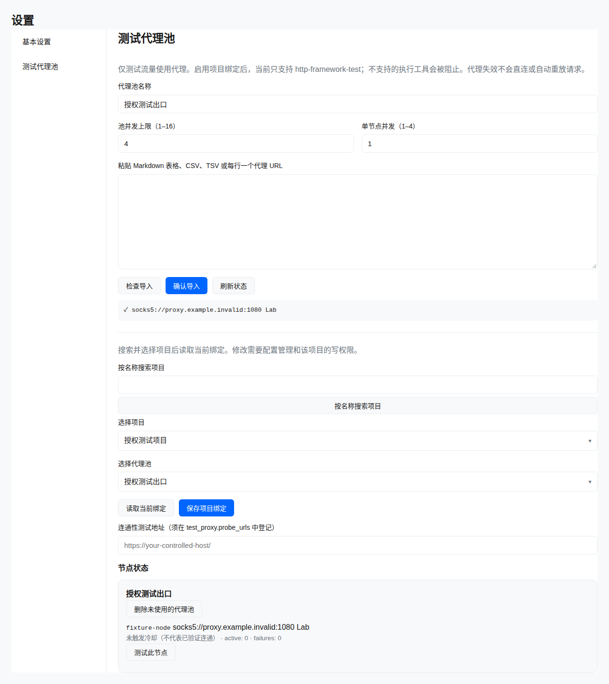
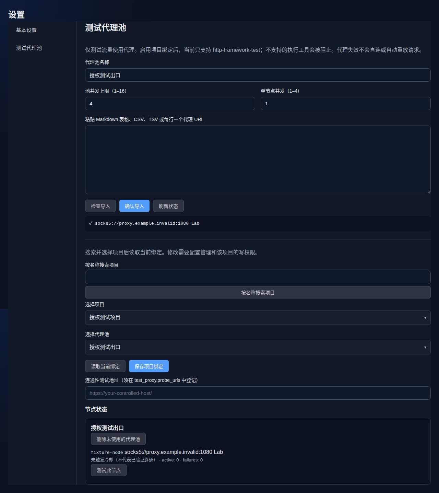

# Test proxy pools

Manage pools in **Settings → Test proxy pools**, then bind a project. The UI follows the existing light/dark theme. Model API and knowledge indexing traffic retain their existing network settings.

Paste Markdown tables, CSV, TSV, or one HTTP/HTTPS/SOCKS5 URL per line. Explicit ports are required. Validate the sanitized preview before importing. Supported columns include `Host`, `Port`, `类型`, `账号`, `密码`, `地区`, `状态`, `DB_id`, and `ProxyAddr`. Conflicting columns and duplicate endpoints reject the entire import. Limits: 200 nodes per import, 256 KiB text, 50 pools. Imports create immutable pools; replace bindings before deleting an old pool.

Only `http-framework-test` currently supports bound project traffic. Unsupported shell, scanner, and external MCP execution tools are blocked for bound projects; local record operations remain available. Each conversation uses a sticky node. There is no automatic proxy rotation, direct fallback, request replay, or retry to bypass target rate limits. HTTP 403/429/5xx responses do not trigger rotation. `NO_PROXY` and tool proxy arguments cannot override the project binding. SOCKS5 resolves target hostnames through the proxy.

This is application-level admission, not host-wide containment. Separately executed programs and privileged extensions require independent container/network namespace egress controls.

## Configuration

Optional top-level configuration, applied after restart:

```yaml
test_proxy:
  max_concurrent: 16
  max_concurrent_per_target: 2
  queue_timeout_seconds: 30
  probe_urls: []
```

Ranges: 1–128, 1–16, 1–120 respectively; zero uses defaults. Pool defaults are 4 concurrent requests, 1 per node, 3 consecutive proxy connection failures before a 60-second cooldown. Pool API ranges: concurrency 1–16, per-node 1–4, threshold 1–10, cooldown 10–3600 seconds. Queue waits are cancellable. Counters and circuit state are process-local and reset after restart; replicas do not share limits.

Authenticated proxies require `TEST_PROXY_KEY`, a Base64-encoded random 32-byte AES-GCM key injected through a secret store or private service environment file. Never commit it. Missing keys prevent credential-bearing imports, while preview remains available. Credentials are encrypted at rest and excluded from API responses and logs. Execution uses a child-process environment; privileged host users can inspect it. Back up the key separately from the database. Before changing keys, unbind and delete existing authenticated pools using the old key, then restart and re-import under the new key.

## API and persistence

All routes require authentication and `config:write`. Project binding routes additionally require `project:write` on that project.

| Method | Path | Request/response |
| --- | --- | --- |
| GET | `/api/test-proxy-pools` | `{pools,health}` |
| POST | `/api/test-proxy-pools/import` | `{name,text,preview,max_concurrent,per_node,failure_threshold,cooldown_seconds}` → sanitized pool |
| DELETE | `/api/test-proxy-pools/:id` | Delete unused pool → `{ok:true}` |
| GET | `/api/test-proxy-pools/binding/:id` | `{pool_id}` |
| PUT | `/api/test-proxy-pools/binding/:id` | `{pool_id}`; empty unbinds → `{ok:true}` |
| POST | `/api/test-proxy-pools/probe` | `{pool_id,node_id,url}` → `{reachable,node_id,http_status,latency_ms}` |

Responses: 200 success; 400 invalid request/probe failure; 401 unauthenticated; 403 forbidden; 409 bound/busy pool; 500 storage failure; 503 unavailable service. Manual probes are disabled until exact controlled URLs are listed in `test_proxy.probe_urls` and the service is restarted. Requests must exactly match an entry; there is no prefix or wildcard matching. Probes issue one bounded HEAD to that configured URL, with no redirects or body retrieval. Receiving an HTTP response proves reachability, not application health. Lack of cooldown does not mean verified connectivity.

The main SQLite database adds `test_proxy_pools(id PRIMARY KEY,document)` and `test_proxy_bindings(project_id PRIMARY KEY,pool_id)`. Bindings reference projects and pools; project deletion cascades bindings. Pool documents hold metadata and encrypted credentials.

## Validation and deployment

On Linux, install `requirements.txt`, including `httpx[http2,socks]`, then run:

```sh
go test -p 2 ./tests/internal/testproxy ./internal/security ./internal/app ./internal/multiagent ./internal/handler
python3 tests/tools/test_proxy_transport.py
go build -p 2 -o cyberstrike-ai ./cmd/server
```

Transport tests use loopback fixtures without real targets or model calls. Back up the current binary, configuration and database; replace the binary, web assets and HTTP recipe, then restart. Rebuild existing Docker images using the existing Dockerfile to include SOCKS dependencies; inject the optional key with container secrets.

Before rollback, stop bound project tasks and remove bindings. Older binaries ignore these tables and cannot enforce proxy policy. Restore the previous binary and recipe; retain new tables and avoid overwriting newer business records with an older database.

See the [Chinese guide](../zh-CN/test-proxy-pools.md) for a table import example.

## UI fixtures

Synthetic data only. Browser regression: `NODE_PATH=/path/to/node_modules node tests/browser/test-proxy.cjs` (Playwright/Chromium required). Set `TEST_PROXY_SCREENSHOTS` to save captures.




